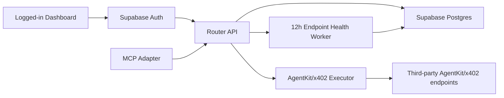
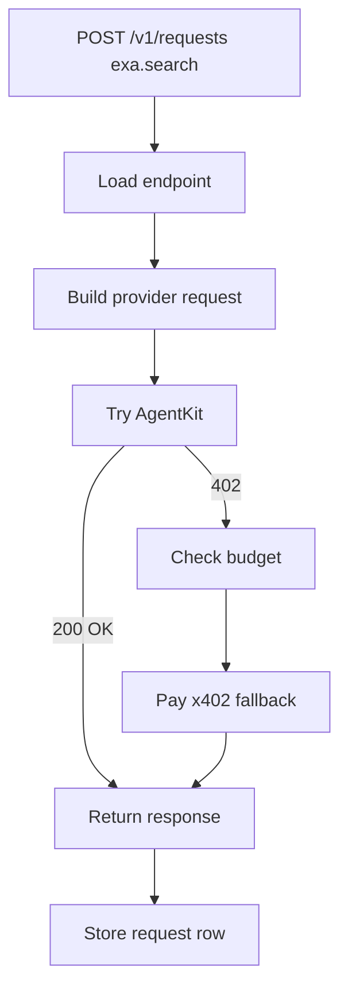

# AgentKit Router E2E Build Plan

## Summary

Build the AgentKit Router as a standalone service that Hermes dogfoods through MCP.

Launch scope:

- named endpoint calls, not automatic routing;
- AgentKit-first execution with automatic x402 fallback inside strict budgets;
- manual endpoint onboarding on our side;
- Supabase Auth and Postgres as the auth/data layer;
- logged-in dashboard where users create API keys tied to their account;
- real third-party E2E checks with explicit spend caps.

Design target: Stripe-like. The API should be boring, explicit, and hard to misuse. The dashboard should be beautiful in a restrained operational way: clear tables, status badges, trace drilldowns, and no decorative complexity.



## Target Repo Shape

```text
agentkit-router/
  apps/
    api/                   # Fastify API proxy
    web/                   # Next.js dashboard
    worker/                # 12h endpoint health checks
  packages/
    auth/                  # Supabase session + API-key verification
    cache/                 # Redis-compatible rate and spend guards
    db/                    # Supabase clients and typed queries
    router-core/           # endpoint registry, typed builders, executor, health utilities
  deploy/                  # DigitalOcean App Platform and Docker assets
  supabase/
    migrations/            # Postgres schema
  tests/
    unit/
    integration/
    e2e/
  .github/
    workflows/             # deterministic CI + live E2E checks
```

The API proxy is the core product and should scale independently from the dashboard. The launch deployment uses separate API, web, and worker containers.

## Database

Use Supabase from day one for both login and persistence. This keeps the MVP simple: one hosted system for users, API keys, request history, endpoint status, usage reporting, and future analytics.

Security baseline:

- enable Row Level Security on every durable table;
- revoke broad `anon` and `authenticated` table grants;
- let authenticated users read only their own `api_keys` metadata and `requests`;
- never grant client roles access to `api_keys.key_hash`;
- allow authenticated users to read global `endpoint_status` and `health_checks`;
- perform router writes through the server-side Supabase service role only.

Core launch tables:

```sql
create table api_keys (
  id text primary key,
  user_id uuid not null references auth.users(id),
  caller_id text not null unique,
  key_hash text not null unique,
  created_at timestamptz not null default now(),
  disabled_at timestamptz
);

create table requests (
  id text primary key,
  ts timestamptz not null default now(),
  trace_id text not null,
  user_id uuid not null references auth.users(id),
  api_key_id text not null references api_keys(id),
  caller_id text not null,
  endpoint_id text not null,
  category text,
  url_host text not null,
  status_code integer,
  ok boolean not null,
  path text not null,
  charged boolean not null,
  estimated_usd numeric,
  amount_usd numeric,
  currency text,
  payment_reference text,
  payment_network text,
  payment_error text,
  latency_ms integer,
  error text
);

create table endpoint_status (
  endpoint_id text primary key,
  status text not null check (status in ('healthy', 'degraded', 'failing', 'unverified')),
  last_checked_at timestamptz,
  latency_ms integer,
  last_error text
);

create table health_checks (
  id text primary key,
  endpoint_id text not null,
  checked_at timestamptz not null default now(),
  status text not null check (status in ('healthy', 'degraded', 'failing', 'unverified')),
  status_code integer,
  latency_ms integer,
  path text,
  charged boolean not null default false,
  estimated_usd numeric,
  amount_usd numeric,
  currency text,
  payment_reference text,
  payment_network text,
  payment_error text,
  error text
);
```

Indexes:

```sql
create index requests_endpoint_ts_idx on requests(endpoint_id, ts desc);
create index requests_user_ts_idx on requests(user_id, ts desc);
create index requests_api_key_ts_idx on requests(api_key_id, ts desc);
create index health_checks_endpoint_checked_idx on health_checks(endpoint_id, checked_at desc);
create index endpoint_status_status_idx on endpoint_status(status);
```

Required derived views:

- total requests over a time range;
- requests by endpoint;
- requests by user;
- requests by caller/API key;
- unique callers in the last 24 hours;
- success rate;
- paid fallback count;
- estimated spend;
- actual charged spend;
- recent traces;
- latest endpoint status.

## Router API

All agent/API endpoints except `GET /health` require `Authorization: Bearer <api-key>`. Dashboard endpoints use the Supabase user session.

API design rules:

- Keep names literal and stable.
- Return `trace_id` on every mutating call.
- Use one error shape across endpoints: `error.code`, `error.message`, `trace_id`.
- Avoid hidden side effects except the expected AgentKit/x402 execution.
- Do not add routing, recommendation, or ranking APIs for launch.

| Route | Purpose |
| --- | --- |
| `GET /health` | Public liveness only. Returns `{ "ok": true, "service": "agentkit-router", "version": "0.1.0" }`. |
| `GET /v1/endpoints` | List manually configured endpoints with latest status. Supports `?category=search`. |
| `POST /v1/requests` | Main path: create a request against a registered endpoint by `endpoint_id`. |
| `GET /v1/requests` | List request traces and power usage views. Supports simple endpoint, API key, status, charged, and time-range filters. |
| `GET /v1/requests/:id` | Return one request trace, including destination host, payment path, charge status, and error details. |

API key creation happens from the logged-in dashboard. The raw key is shown once, the database stores only its hash, and every request made with that key is associated with the owning Supabase `user_id`.

`POST /v1/requests` request:

```json
{
  "endpoint_id": "exa.search",
  "input": {
    "query": "AgentKit examples",
    "num_results": 5
  },
  "maxUsd": "0.05"
}
```

`POST /v1/requests` response:

```json
{
  "id": "req_123",
  "trace_id": "trace_123",
  "endpoint_id": "exa.search",
  "path": "agentkit",
  "charged": false,
  "status_code": 200,
  "body": {}
}
```

Runtime behavior:



## Endpoint Template

Every manually onboarded endpoint must include:

- endpoint config: id, provider, category, name, description, URL, method, estimated cost, AgentKit/x402 support;
- typed request builder that maps tool input to provider request;
- response normalizer if provider output needs shaping;
- cheap health probe;
- mocked fixture for deterministic tests;
- live E2E fixture with max spend;
- admin UI display metadata.

Provider-side requirement stays minimal: they should support AgentKit/x402 correctly and ideally expose AgentCash-compatible OpenAPI or pay.sh-style metadata. We map their metadata into our config manually.

## Endpoint Health

Run a scheduled health worker every 12 hours.

For each endpoint:

1. Load the endpoint config and health probe.
2. Execute the probe through the same AgentKit/x402 path as normal calls.
3. Enforce a low health-check max spend.
4. Insert a `health_checks` row.
5. Upsert `endpoint_status`.

`GET /v1/endpoints` joins endpoint config with `endpoint_status`; launch does not expose a separate status route.

Statuses:

```text
healthy
degraded
failing
unverified
```

Dashboard row:

```text
endpoint      category        status      last checked        last error
exa.search    search          healthy     2026-05-05 12:00    -
maps.places   maps            degraded    2026-05-05 12:00    price mismatch
```

## Admin Dashboard

First UI is a logged-in dashboard backed by Supabase Auth.

Design direction:

- Stripe-like layout: left nav, dense tables, clear status badges, restrained color, fast filters.
- First screen should be the endpoint operations table, not a marketing page.
- Every row should answer: is it working, when was it checked, what did it cost, and what failed last?
- Manual test calls should feel like Stripe test-mode actions: clear button, confirmation of spend cap, immediate trace result.

Required views:

- login/logout;
- API key list with create, reveal-once, and disable actions;
- endpoint list with category, status, last checked, last error, estimated cost;
- endpoint detail page with recent requests and health-check history;
- request history table with caller, endpoint, path, charged, status, latency, error;
- request detail drawer/page backed by `GET /v1/requests/:id`;
- manual "test endpoint" action that creates `POST /v1/requests` with a fixture input;
- usage summary for last 24 hours and last 7 days, derived from request queries.

Frontend integration tests should click through these surfaces and verify real API wiring, not just static rendering.

## MCP Adapter

MCP tools for launch:

```text
agentkit_list_endpoints
agentkit_usage_summary
agentkit_call_named_tool
exa_x402_search
exa_x402_contents
browserbase_x402_search
browserbase_x402_fetch
browserbase_x402_session
```

Provider-specific tools are the default agent UX. `agentkit_call_named_tool` exists for generic clients and debugging.

All MCP call tools should create router requests through `POST /v1/requests`; they should not call provider URLs directly or load wallet secrets.

## CI And E2E

Normal PR workflow:

- install/build the app;
- run endpoint config validation;
- run request-builder unit tests;
- run mocked AgentKit/x402 flow tests;
- run API integration tests;
- run frontend integration tests against a local test server.

Scheduled/release workflow:

- run live third-party E2E checks;
- allow real spending only with explicit max spend per endpoint and per workflow;
- write a test report artifact with endpoint id, status, path, charged flag, spend, latency, and error;
- fail if any required production endpoint is failing.

Live E2E policy:

- real third-party checks are required because endpoint health depends on external services;
- each live test must declare `maxUsd`;
- health checks and CI live checks must use separate API keys/caller ids;
- never print API keys, wallet keys, Authorization headers, or payment payloads in logs.

## Task Checklist

1. Create one deployable app with internal modules for router API, admin UI, endpoint registry, MCP adapter, executor, health worker, and shared test harness.
2. Add Supabase Auth wiring and migrations for `api_keys`, `requests`, `endpoint_status`, and `health_checks`.
3. Implement dashboard API-key creation, reveal-once behavior, disable flow, and API-key verification with hashed keys.
4. Port the existing AgentKit/x402 executor into the router service.
5. Implement `GET /health`, `GET /v1/endpoints`, `POST /v1/requests`, `GET /v1/requests`, and `GET /v1/requests/:id`.
6. Move manual endpoint config and request builders into the internal endpoint module.
7. Add endpoint template tests and require them for each endpoint.
8. Implement request persistence for all `POST /v1/requests` attempts, including payment receipt fields.
9. Implement 12-hour health worker and endpoint status writes.
10. Build the Supabase-authenticated dashboard.
11. Add frontend integration tests for endpoint list, status, request history, and manual test action.
12. Add deterministic CI workflow for PRs.
13. Add live E2E workflow for scheduled/release checks with spend caps.
14. Update Hermes MCP configuration to use the new router service.

## Acceptance Criteria

- A new endpoint can be added by following one template.
- The router records every request and every scheduled health check in Supabase.
- Dashboard login uses Supabase Auth, and every API key belongs to the logged-in user who created it.
- The admin UI shows endpoint health, recent usage, and request history.
- CI proves deterministic behavior on every PR.
- Scheduled/release E2E proves third-party endpoints still work with real calls.
- All automated real-spend paths have explicit max spend limits.
- Hermes can use the router through MCP without wallet secrets in the MCP process.
- The public launch API is resource-style and minimal: health, endpoints, and requests.
