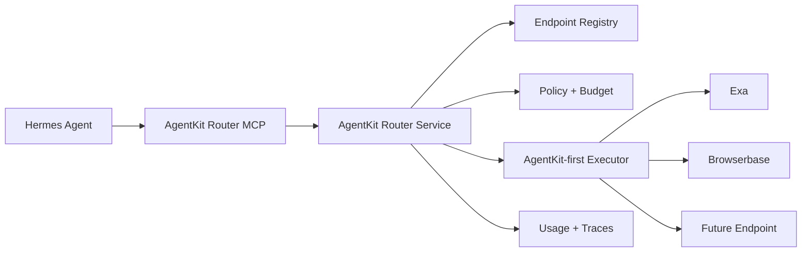
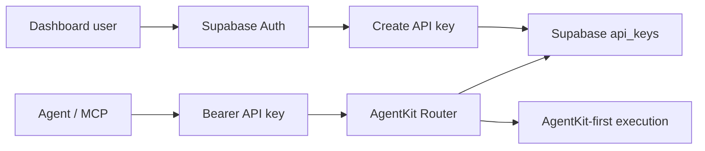
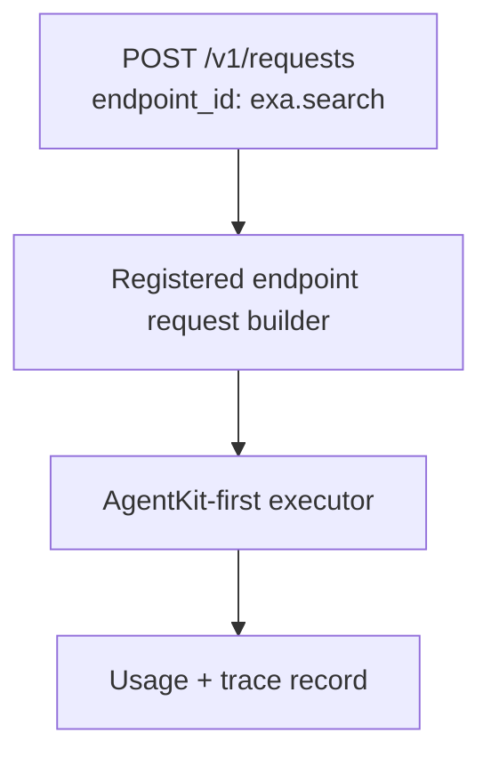
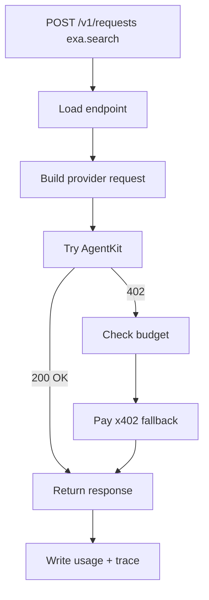

# AgentKit Router MVP

## Goal

Build a separate service that makes AgentKit-compatible paid tools reliable and easy for agents to use.

Hermes should be the first dogfooding client, but the service should not be Hermes-specific. The service should eventually stand alone as a low-level router for AgentKit/x402-capable endpoints, similar in spirit to how OpenRouter normalizes model access.

The first product problem is not reputation. The first problem is:

- agents do not reliably know which services support AgentKit;
- developers do not want to manually wrap each request with `@worldcoin/agentkit`;
- agents need reliable named tools for AgentKit-compatible services;
- users need to see where requests were sent and whether a payment path was used.

## MVP Scope

The MVP should support:

- named endpoint calls, for example `exa.search`;
- reliable AgentKit-first execution for every registered endpoint;
- automatic paid x402 fallback when AgentKit does not satisfy the request;
- manually configured endpoints;
- simple API key authentication;
- request storage that can support usage views, traces, unique caller counts, endpoint status, and spend reporting;
- endpoint health checks every 12 hours;
- MCP tools that expose the router to agents.

The MVP does not need to handle massive throughput, but it should use a hosted database from day one. Use Supabase Postgres for launch so request history, endpoint health, usage reporting, and future analytics do not need a storage redesign.

## Product Principles

The product should feel Stripe-like: simple API, reliable primitives, excellent observability, and a calm admin UI.

- Keep the public model small: endpoints, requests, health checks, API keys.
- Prefer boring explicit behavior over clever routing.
- Every request should have a trace ID and a clear payment path.
- Every endpoint should show current health and last error.
- The dashboard should be sparse, fast, and operational rather than decorative.

## Core Design

The service has two layers:

1. **AgentKit Router Service**
   - HTTP service.
   - Owns endpoint registry, usage tracking, traces, policy enforcement, and AgentKit/x402 execution.
   - Holds signer/wallet access where needed.

2. **MCP Adapter**
   - Thin agent-facing adapter.
   - Exposes named endpoint tools.
   - Does not hold wallet secrets.
   - Does not implement AgentKit itself.

Hermes should call the MCP adapter. The MCP adapter should call the router service.



## Auth

Use Supabase for both dashboard login and durable data.

- Dashboard users sign in with Supabase Auth.
- Logged-in users create API keys from the dashboard.
- Each API key belongs to the Supabase user who created it.
- Requests pass `Authorization: Bearer <api-key>`.
- The server stores only a hash of each API key.
- The API key maps to a caller record such as `hermes-prod`.
- Request rows keep both `user_id` and `api_key_id` for dashboard filtering.
- No scopes in MVP.
- No user-supplied `agentId`; the router derives caller identity from the API key.
- Budget controls can be global at first, then per API key if needed.

This keeps the system simple: one login system, one hosted database, one place to inspect users, keys, requests, and endpoint health. The key only authenticates the caller; it does not bypass endpoint allowlists, budget checks, AgentKit-first execution, or paid fallback rules.

MVP key creation happens in the dashboard:

- user clicks "Create API key";
- router creates a random key and stores only its hash;
- raw key is shown once;
- user can disable the key later.



## Categories

Categories group endpoints for discovery. They do not perform automatic routing in the MVP.

Examples:

```text
ai_ml
search
maps
data
compute
productivity
browser_usage
travel
commerce
```

An endpoint belongs to one category:

```json
{
  "id": "exa.search",
  "category": "search"
}
```

For launch, agents still call named tools or named registered endpoints. Categories help agents and dashboards answer "what tools are available for search?" without needing embeddings, classification, or ranking.

In MVP, the router never chooses an endpoint. Endpoint selection happens before the router via an MCP tool name such as `exa_x402_search` or an explicit `endpoint_id` such as `exa.search`.

## MVP MCP Tools

Expose these first:

```text
agentkit_list_endpoints
agentkit_usage_summary
agentkit_call_named_tool
```

Keep existing provider-specific tools as deterministic escape hatches:

```text
exa_x402_search
exa_x402_contents
browserbase_x402_search
browserbase_x402_fetch
browserbase_x402_session
```

Provider-specific tools are the launch UX. `agentkit_call_named_tool` exists for generic clients that want to call a registered endpoint by ID.

## HTTP API

MVP routes:

| Route | Who uses it | What it does |
| --- | --- | --- |
| `GET /health` | Ops, deployment checks | Public liveness only. Returns `{ "ok": true, "service": "agentkit-router", "version": "0.1.0" }`. No request is sent to a paid service. |
| `GET /v1/endpoints` | Dashboard, MCP adapter, debugging | Lists registered endpoint definitions with latest status fields. Optional `?category=search` filter answers "what search tools are available?" |
| `POST /v1/requests` | Main API path | Creates a request against a specific registered endpoint such as `exa.search`. |
| `GET /v1/requests` | Dashboard, MCP adapter, debugging | Lists recent request traces. Supports simple filters such as endpoint, API key, status, charged, and time range. Usage views are derived from this. |
| `GET /v1/requests/:id` | Dashboard, MCP adapter, debugging | Shows one request trace, including payment path, destination host, charge status, and error details. |

No automatic routing, ranking, separate usage endpoint, or low-level arbitrary fetch endpoint in the MVP. New endpoint experiments should become manual registry entries before agents can call them.



`POST /v1/requests` is the main product primitive:

```json
{
  "endpoint_id": "exa.search",
  "input": {
    "query": "AgentKit examples",
    "num_results": 5
  },
  "maxUsd": "0.05"
}
```

Response:

```json
{
  "id": "req_123",
  "trace_id": "trace_123",
  "endpoint_id": "exa.search",
  "path": "agentkit",
  "charged": false,
  "status_code": 200,
  "body": {}
}
```

## Endpoint Onboarding

For MVP, endpoint onboarding is manual on our side. Providers should not need to write a custom integration for us.

Provider requirement:

- support AgentKit/x402 correctly at runtime;
- preferably expose AgentCash-compatible OpenAPI at `/openapi.json`, or provide enough pay.sh-style provider metadata for us to map manually.

Our work:

- add the endpoint to our config;
- define the typed request builder;
- define a cheap health probe;
- verify AgentKit/x402 behavior before enabling it.

MVP schema:

```json
{
  "id": "exa.search",
  "provider": "exa",
  "category": "search",
  "name": "Exa Search",
  "description": "Neural web search with optional text and summary extraction.",
  "url": "https://api.exa.ai/search",
  "method": "POST",
  "agentkit": true,
  "x402": true,
  "estimated_cost_usd": 0.007
}
```

The MVP can keep this as a checked-in JSON file. Later, this can move to a hosted registry with signed listings.

## Standards Alignment

Match existing agent-payment discovery formats where possible so providers can integrate without learning a new standard.

### AgentCash

AgentCash expects providers to expose OpenAPI at `/openapi.json`. Paid operations include:

- request and response schemas;
- `responses.402`;
- `x-payment-info` with price and supported protocols;
- `info.x-guidance` for agent-friendly usage notes.

Compatibility target:

- Import endpoint metadata from OpenAPI when available.
- Preserve `x-payment-info` fields instead of inventing a separate payment metadata shape.
- Generate or serve `/openapi.json` for the router once endpoints are registered.

### pay.sh

pay.sh models providers with an explicit provider spec and catalog entry. Useful shared concepts:

- `name`, `title`, `description`, `category`, `version`;
- explicit `endpoints[]` as both allowlist and pricing config;
- endpoint fields like `method`, `path`, `resource`, `description`, and metering/pricing;
- gateway URLs, not upstream URLs, for agent-facing calls;
- OpenAPI served from the gateway with upstream auth stripped.

Compatibility target:

- Keep categories close to pay.sh categories where practical: `ai_ml`, `search`, `maps`, `data`, `compute`, `productivity`, plus project-specific categories only when needed.
- Treat registered endpoints as the allowlist.
- Add an exporter later that can produce a pay.sh-style provider spec from the registry.

MVP action: keep endpoint config manual, but follow AgentCash and pay.sh metadata shapes so onboarding a compatible provider is mostly copying/mapping metadata, not asking them to build something custom.

## Request Data Store

Store one row per request. This is the core data structure for usage, traces, status, and reporting.

```json
{
  "id": "req_123",
  "ts": "2026-05-05T00:00:00.000Z",
  "trace_id": "trace-id",
  "user_id": "supabase-user-id",
  "api_key_id": "key_hermes_prod",
  "caller_id": "hermes-prod",
  "endpoint_id": "exa.search",
  "category": "search",
  "url_host": "api.exa.ai",
  "status_code": 200,
  "ok": true,
  "path": "agentkit",
  "charged": false,
  "estimated_usd": "0.007",
  "amount_usd": null,
  "currency": null,
  "payment_reference": null,
  "payment_network": null,
  "payment_error": null,
  "latency_ms": 812,
  "error": null
}
```

Start with Supabase Postgres tables:

Security baseline: enable Row Level Security on all tables. Authenticated users can read only their own API-key metadata and request rows; client roles must not be granted access to `api_keys.key_hash`. Endpoint status and health-check history are readable only to authenticated users. Router inserts and updates use the server-side Supabase service role.

```sql
create table api_keys (
  id text primary key,
  user_id uuid not null references auth.users(id),
  caller_id text not null unique,
  key_hash text not null unique,
  created_at timestamptz not null default now(),
  disabled_at timestamptz
);

create table requests (
  id text primary key,
  ts timestamptz not null default now(),
  trace_id text not null,
  user_id uuid not null references auth.users(id),
  api_key_id text not null references api_keys(id),
  caller_id text not null,
  endpoint_id text not null,
  category text,
  url_host text not null,
  status_code integer,
  ok boolean not null,
  path text not null,
  charged boolean not null,
  estimated_usd numeric,
  amount_usd numeric,
  currency text,
  payment_reference text,
  payment_network text,
  payment_error text,
  latency_ms integer,
  error text
);

create table endpoint_status (
  endpoint_id text primary key,
  status text not null check (status in ('healthy', 'degraded', 'failing', 'unverified')),
  last_checked_at timestamptz,
  latency_ms integer,
  last_error text
);

create table health_checks (
  id text primary key,
  endpoint_id text not null,
  checked_at timestamptz not null default now(),
  status text not null check (status in ('healthy', 'degraded', 'failing', 'unverified')),
  status_code integer,
  latency_ms integer,
  path text,
  charged boolean not null default false,
  estimated_usd numeric,
  amount_usd numeric,
  currency text,
  payment_reference text,
  payment_network text,
  payment_error text,
  error text
);
```

Derived views should support:

- total requests;
- requests by endpoint;
- requests by caller/API key;
- unique callers over the last 24 hours;
- success rate;
- paid fallback count;
- estimated spend;
- actual charged spend;
- recent traces.
- health-check history.

Do not store raw API keys, private keys, Authorization headers, or wallet secrets in traces.

## Runtime Behavior

When a caller uses `POST /v1/requests`, the router:

1. Loads the named endpoint from the registry.
2. Builds the provider request from that endpoint's typed input schema.
3. Sends the request through official `@worldcoin/agentkit`.
4. If AgentKit succeeds, returns the response with `path=agentkit`.
5. If the provider still returns `402`, enforces per-request limits.
6. Pays through x402 fallback.
7. Writes a usage event and trace.

The signer should remain inside the router service. Agent-facing tools should never load wallet private keys.



## Endpoint Health

The router should run a background health check for every registered endpoint every 12 hours.

The check should verify:

- the endpoint URL is reachable;
- the endpoint still returns an expected AgentKit/x402 challenge or successful test response;
- the parsed price/payment metadata matches the registry closely enough;
- the request builder still produces a valid request shape;
- latency and error message are recorded.

Health checks should use a cheap probe request defined per endpoint. If a provider cannot offer a free or low-cost probe, mark the endpoint as `unverified` and show that clearly in the UI.

Status values:

```text
healthy
degraded
failing
unverified
```

The UI should show status on every endpoint row:

```text
endpoint      category        status      last checked        last error
exa.search    search          healthy     2026-05-05 12:00    -
maps.places   maps            degraded    2026-05-05 12:00    price mismatch
```

Status is included in `GET /v1/endpoints`; launch has no separate status API.

## Hermes Dogfooding

Hermes should use this through MCP:

- default search path: `exa_x402_search`;
- explicit generic path: `agentkit_call_named_tool`;
- usage inspection: `agentkit_usage_summary`;
- debugging: trace IDs returned in tool responses.

Hermes-specific notes should live in AgentBrain, but the router should remain a generic product service.

## MVP Implementation Plan

1. Add endpoint registry with Exa and Browserbase entries.
2. Add simple API-key auth with hashed keys.
3. Add router HTTP routes: `GET /health`, `GET /v1/endpoints`, `POST /v1/requests`, `GET /v1/requests`, and `GET /v1/requests/:id`.
4. Derive dashboard usage from request rows instead of a separate usage API.
5. Add MCP tools for endpoint listing, usage, named calls, and provider-specific tools.
6. Route Hermes search behavior toward `exa_x402_search`.
7. Dogfood with Exa first.
8. Record traces, estimated spend, actual payment fields, and errors in Supabase.
9. Add 12-hour endpoint health checks and status display.

## Extensions

### Endpoint Listing

Eventually, providers should be able to list applications, tools, or agents.

Possible listing requirements:

- signed endpoint manifest;
- domain ownership proof;
- World ID verification for sybil resistance;
- organization-level verification;
- sample challenge/response proving AgentKit support;
- pricing metadata;
- privacy/data retention disclosures.

World ID likely fits here as a sybil-resistance primitive for providers or agent identities, but it is not required for MVP.

### Reputation

Reputation should be built after the router reliably works and after there are multiple services competing for the same capability.

Signals:

- unique agents in last 24 hours;
- successful AgentKit completions;
- paid fallback rate;
- price consistency;
- receipt validity;
- latency;
- uptime;
- error rate;
- provider verification;
- user/agent reports.

### Ranking

Ranking should be an extension, not MVP behavior.

Add ranking when there are multiple credible endpoints for the same capability. At that point, rank by capability match, price, AgentKit success rate, recent usage, and reputation. Until then, explicit named endpoint calls are simpler and more reliable.

### Hosted Product

Later shape:

- hosted public registry;
- dashboard for endpoint providers;
- dashboard for agent users;
- API keys / auth;
- organization accounts;
- richer usage analytics;
- public endpoint pages;
- hosted MCP server.
- scoped API keys if real customers need different permissions per key.

### Scale

When needed:

- use append-only event logs;
- add queue-backed trace processing;
- cache endpoint resolution and ranking if ranking is added;
- aggregate 24h unique agent metrics periodically.

Do not optimize for this until real usage demands it.
