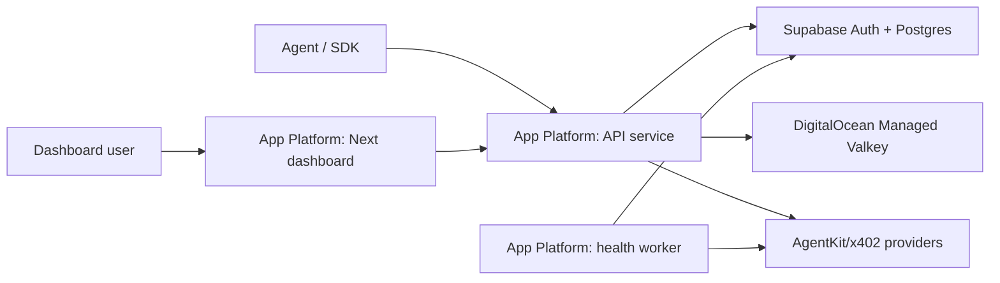

# ToolRouter Deployment Hosting

## Recommendation

Use DigitalOcean App Platform for the public MVP, with Supabase and Managed Valkey as hosted dependencies.

This keeps operations simple: one App Platform app for runtime, one Supabase project for auth/data/RLS, and one Valkey cluster for fast limits and spend counters.

## Production Shape

- `apps/api`: dedicated CPU App Platform service, minimum 2 containers, autoscale to 8.
- `apps/web`: fixed 1-container App Platform service.
- `apps/worker`: fixed 1-container App Platform worker running 12-hour health probes.
- Supabase: hosted Postgres, Auth, migrations, RLS, request traces, API keys, endpoint status.
- DigitalOcean Managed Valkey: per-IP limits, per-key limits, and rolling spend counters.

## Why This Is The Default

- App Platform is easier to operate than Kubernetes for launch: GitHub deploys, health checks, logs, alerts, routes, and scaling live in one app spec.
- The API is stateless, so horizontal scaling is straightforward once rate/spend state is in Valkey and durable records are in Supabase.
- Supabase keeps dashboard login, user-scoped API keys, RLS, and data inspection in one place.
- Valkey is Redis-compatible and fits the hot-path counters that should not wait on Postgres.

## Scale Path

- Start with the App Platform spec in `deploy/digitalocean-app.yaml`.
- Increase API `max_instance_count` before changing architecture.
- Move only the API to Kubernetes or a container orchestrator if App Platform limits become the blocker.
- Keep the dashboard on App Platform unless it becomes a real traffic surface.
- Keep Supabase until request analytics or write volume demands a dedicated Postgres cluster.

## Monitoring Defaults

- `/health` is the API readiness and liveness endpoint.
- The worker exposes `/health` so App Platform can restart it if it wedges.
- App Platform alerts are enabled for deploy/domain failures plus CPU and memory pressure.
- Durable request traces record endpoint, path, status, latency, charge status, spend estimate, and error.
- Endpoint probes run every 12 hours and update both latest status and health-check history.

## Launch Checklist

- Create Supabase project and apply migrations in `supabase/migrations`.
- Create DigitalOcean Managed Valkey and set `VALKEY_URL`.
- Set App Platform secrets from `.env.example`.
- Replace `YOUR_GITHUB_ORG/toolrouter` in `deploy/digitalocean-app.yaml`.
- Set `TOOLROUTER_CORS_ORIGIN` to the public dashboard origin.
- Deploy the App Platform spec.
- Confirm `/health`, dashboard login, API key creation, and one low-spend endpoint test.

## References

- DigitalOcean App Platform scaling: https://docs.digitalocean.com/products/app-platform/how-to/scale-app/
- DigitalOcean App Platform health checks: https://docs.digitalocean.com/products/app-platform/how-to/manage-health-checks/
- DigitalOcean App Platform workers: https://docs.digitalocean.com/products/app-platform/how-to/manage-workers/
- DigitalOcean Managed Valkey: https://docs.digitalocean.com/products/databases/valkey/
