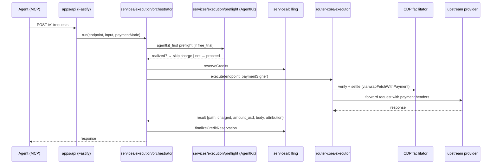

# refactor: ToolRouter modularity and attribution

## Summary

Consolidates endpoint and seller-service definitions behind a single declarative manifest (drop one file → MCP, dashboard, registry, executor, health probe and tests pick it up), reforms the health classifier so settlement failures, AgentKit challenges, router-side wallet errors, and upstream failures each get their own label and per-layer health surface (no more "Provider payment required" overloading), extracts the embedded Manus seller wrapper into its own module sized to host future first-party services as peers, and decomposes the 2444-line `apps/api/src/app.ts` into thin Fastify routes plus thick domain modules. Out of scope: async/job-based `POST /v1/requests`, per-category provider failover, AgentKit session tokens, idempotency-key infrastructure, same-request settle retry, and the async-task lifecycle generalization (each deferred for distinct reasons captured in Scope Boundaries).

---

## Problem Frame

ToolRouter ships three endpoints (`exa.search`, `browserbase.session`, `manus.research`) and one first-party seller wrapper (`/x402/manus/research`). Two pain shapes have emerged:

**Modularity drag.** Adding an endpoint touches ~9 surfaces today — the endpoint module, the builder registry, the registry list, the category registry, the MCP server (which re-declares JSON schemas, depth enums, default `maxUsd` maps, and tool tables that duplicate router-core metadata), the landing-page fallback (which hand-mirrors registry shape), the dashboard provider-logo maps (duplicated across two files), and three test layers. The MCP package can't even import router-core because it ships as a standalone npm artifact. The seller wrapper for Manus is embedded inside `app.ts`'s closures, so adding a second first-party seller service today means edit-the-gateway, not drop-a-file.

**Attribution gaps.** On 2026-05-19, both Exa and Browserbase returned 402 with `Settlement failed:` bodies despite valid x402 payloads — we proved by calling CDP `/verify` and `/settle` directly with our own keys against their requirements that the payments were settlable and the failure was on the seller side of CDP, not on us. The system surfaced this as the generic "Provider payment required" because `safeHealthError` in `packages/router-core/src/health/worker.ts:79-89` collapses every 402 to one label regardless of body. Operators (and downstream consumers of `/v1/status`) had no way to distinguish a clean x402 challenge envelope (the protocol working) from a settlement failure (seller-side CDP integration broken) from a router-side wallet error (us). The 2444-line `app.ts` makes any of these fixes expensive to attempt cleanly because the classification logic lives inline in three different routes.

The goal is a system where adding a new buyer-side endpoint or seller-side service is a single declarative file change, where the failing layer of every 4xx/5xx is honestly named at the source, and where the gateway is thin enough that domain logic isn't hostage to route ordering. AgentKit per-request stays as-is (provider-constrained); the agent contract stays synchronous (agents default-assume sync responses); per-category provider failover, idempotency-key infrastructure, same-request settle retry, and async-task generalization are all deferred (rationale in Scope Boundaries).

---

## Requirements

- R1. Adding a new buyer-side endpoint requires editing **one** endpoint manifest file plus its test fixture; registry, MCP tool, dashboard metadata, landing-page status row, and live-smoke harness derive from the manifest.
- R2. Adding a new first-party seller service requires editing **one** seller manifest file (route, upstream URL + auth, pricing function, AgentKit mode, payTo lookup) plus a small wrapper registration; no `app.ts` edit.
- R5. Health classification distinguishes (a) a clean x402 challenge envelope (protocol working, not degraded), (b) settlement failure (seller-side / facilitator-side breakage), (c) router-side payment error (our wallet / credentials), and (d) other upstream failures. Each surfaces a label that names the failing layer.
- R6. `/v1/status` and `endpoint_status` expose per-layer health (network reach, AgentKit benefit realized, x402 facilitator settlement, upstream service) so dashboard and external consumers can see which layer broke.
- R7. `/x402/manus/research` lives in its own module under `apps/api/src/sellers/manus/` and uses a shared `createSellerService(...)` primitive; behavior is unchanged.
- R8. `apps/api/src/app.ts` shrinks substantially (target shape: thin Fastify wiring — imports, error handler, CORS, plugin registration). Domain logic moves into per-concern modules under `apps/api/src/{routes,services,sellers}/`. The behavioral target is that the orchestrator is unit-testable without spinning up Fastify, and adding a new route plugin does not require editing `app.ts`.
- R10. Existing integration tests in `tests/integration/router/api.test.mjs` and live-smoke tests in `tests/live/endpoints/*.live.test.mjs` continue to pass; new manifest-driven harness replaces the three per-provider live smoke files with one parametric harness.

*R-ID gaps at R3, R4, R9 are intentional — those requirements were dropped during the doc-review pass (idempotency-key infra, same-request settle retry, async-task generalization). See Scope Boundaries → Deferred to Follow-Up Work.*

---

## Scope Boundaries

- AgentKit verification timing stays per-request. No session-scoped AgentKit token swap. (Provider-constrained: some endpoints expect a freshly-signed AgentKit header per call; centralizing into a session token would break those.)
- Request shape stays synchronous from the agent's perspective. `POST /v1/requests` does not change to a job-based polling/streaming contract.
- Per-category provider failover is out of scope. Each category has one endpoint service today. Multi-provider redundancy and failover routing will land when we onboard a second provider in any category.
- No replacement of CDP (facilitator), Crossmint (signers), or Supabase (durable store). The plan is a structural + attribution refactor, not an infra swap.
- No pricing or business-model changes. AgentKit value categories (`free_trial`, `access`, `discount`) and per-endpoint cost defaults are preserved as-is.
- The published MCP package surface (`@worldcoin/toolrouter` tool names + input shapes) does not change. Internal generation may change; external contract is preserved.
- No new top-level dependencies (specifically: not adding `fastify-plugin`). Gateway decomposition uses plain `async function plugin(app, opts)` registrations with `app.decorate(...)` for shared deps — the existing DI bag already supports test overridability.

### Deferred to Follow-Up Work

- **Idempotency-key infrastructure** (`Idempotency-Key` header + `idempotent_requests` table + replay semantics). Deferred because: no partner has asked for it, no observed double-execution incident, and the well-known design space (sentinel-row vs advisory lock vs accept-race) warrants real user demand before committing. Revisit when a partner asks or we see retry-induced duplication in traces.
- **Same-request settle retry inside the executor.** Deferred because: `@x402/core`'s `wrapFetchWithPayment` is a black-box that does verify + settle + forward in one fetch — there's no settle handle to retry without forking the SDK. The 2026-05-19 incident was sustained (not transient), so retries inside the request window wouldn't have helped. Attribution-first errors (U3) plus caller-side retry are the v1 reliability story.
- **Async-task lifecycle generalization** (manifest `async_task` field + generic `runAsyncTaskFlow`). Deferred because: generalizing off N=1 (only Manus) risks baking the wrong abstraction. Revisit when a second async endpoint is on the roadmap so the strategy interface can be validated against two concrete cases.
- Per-category provider failover routing — separate plan when second-provider onboarding lands.
- Async-job-shape `/v1/requests` (return `request_id` immediately, agent polls or webhooks back) — separate plan if/when sync's tail-latency budget exceeds tolerance.
- Replacing the hand-rolled Stripe v1 fetch client in `apps/api/src/stripe.ts` with the official `stripe` SDK — separate plan.
- Generic web-side endpoint catalog page (today `/v1/status` serves the landing-page fallback) — separate plan.

---

## Context & Research

### Relevant Code and Patterns

- **Endpoint definition template:** `packages/router-core/src/endpoints/search/exa/search.ts`, `.../browser_usage/browserbase/session.ts`, `.../research/manus/research.ts`. Each is a frozen object with metadata, AgentKit/x402 flags, health probe config, live smoke config, and a builder ref.
- **Endpoint validation harness** (already the closest thing to a manifest schema today): `packages/router-core/src/testing/endpointHarness.ts`. Exports `assertValidEndpointConfig`, `assertEndpointFixtureBuilds`, `assertEndpointHealthProbeBuilds` — extend this into the canonical manifest validator.
- **Registry surface:** `packages/router-core/src/endpoints/registry.ts` (registry list + `materializeEndpoint` + `endpointToJSON` whitelist), `packages/router-core/src/endpoints/builders.ts` (typed builders + price tables), `packages/router-core/src/endpoints/categories.ts` (recommended-endpoint registry).
- **Seller wrapper template:** `apps/api/src/manus.ts`. Lift `MANUS_API_KEY` + `mode: { type: "free-trial", uses: 2 }` + upstream URL/path + price function out as parameters; the rest is provider-agnostic.
- **Executor (shape-driven, no per-endpoint switch):** `packages/router-core/src/executor/agentkitExecutor.ts`. `usesAgentKitProofHeader(endpoint)` at line 125 reads `endpoint.agentkit_proof_header`; `requirementAtomicAmount` (line 301) handles both x402 v1 and v2 transparently. Preserve this convention.
- **DI bag pattern:** `createApiApp({ store, executor, cache, crossmint, stripe, alerts, datadog, agentBookVerifier, agentBookRegistration, manusWrapper, createManusWrapper, manusFetch, logger })` in `apps/api/src/app.ts:1836-1905`. Plugin decomposition preserves overridability for the integration tests; plain plugin functions (not `fastify-plugin`) consume the decorations set on the Fastify instance.
- **Health classifier:** `packages/router-core/src/health/worker.ts:74-124` (`safePaymentError`, `safeHealthError`, `statusFromResult`). Mirror in `apps/api/src/app.ts:159-171` (`publicStatusError`, `publicRequestError`) — both must move together to a shared `attribution` module in router-core.
- **Trace ID convention:** `traceId = trace_${uuid}` minted at `app.ts:2171`. Same prefix pattern for new IDs.

### Institutional Learnings

- **`agents.md`** at the repo root is the durable design doc. The "Endpoint Template" section already specifies the onboarding mini-skill, AgentKit value categories, and the `agentkit_proof_header` convention. This plan formalizes that mini-skill as code (a manifest schema).
- **The 2026-05-19 incident analysis** (in-session): Buyer-side payload was valid; CDP `/verify` returned `isValid: true` for both Exa and Browserbase requirements using our keys, and CDP `/settle` succeeded when we called it directly with the same authorization. The 402 + "Settlement failed" responses originated from the sellers' own `/settle` calls to CDP — not from our payload. This is why R5/R6 distinguish *settlement failure* from *router payment error* as separate labels — they fail at different layers and need different operator response.
- **MCP cross-package boundary:** `apps/mcp` does not declare a workspace dependency on `@toolrouter/router-core` because the MCP ships as a standalone published npm package with `dist/server.js`. Sharing endpoint metadata between router-core and MCP requires either a codegen step at `prepack` time or an embedded JSON manifest — the manifest cannot be imported at runtime in the published artifact.
- **Web cross-package boundary:** `apps/web` similarly has no workspace dep on router-core (verified). U2 picks between adding the dep + letting Next.js bundle from TS, or reusing the same `endpoints.json` artifact MCP consumes via a small generator into `apps/web/public/`.

---

## Key Technical Decisions

- **One endpoint-manifest schema in router-core; published JSON for MCP.** Router-core consumers (API, worker) import the typed manifest directly. The MCP package gets a build-time-generated `endpoints.json` embedded in its dist via a `prepack` script. Rationale: cannot share TS source across the npm boundary; codegen at publish time keeps MCP standalone while making router-core the single source of truth. (Same artifact also serves apps/web if a workspace dep is undesirable there.)
- **Health classifier reads the response body to attribute the layer.** `safeHealthError` becomes `attributeFailure(result)` returning `{ layer: "facilitator" | "router_payment" | "agentkit" | "upstream" | "transport" | "rate_limit" | "timeout", label: string, retryable: boolean }`. Body markers like `"Settlement failed"`, `"Failed to settle payment"` map to `facilitator`. Router-side payment errors keep the existing wallet/sig labels under `router_payment`. Generic 402 envelopes with no settlement marker map to `agentkit` (challenge still active) and are NOT degraded.
- **`attribution` module lives in `packages/router-core/src/attribution.ts`.** Both the health worker (router-core) and the gateway's `publicStatusError`/`publicRequestError` (apps/api) import the same canonical implementation, so labels can never diverge again. The API layer gets a thin `apps/api/src/services/attribution.ts` re-export for ergonomic call sites.
- **Per-layer health surfaces are denormalized into the existing `endpoint_status` row.** New columns: `layer_facilitator_status`, `layer_agentkit_status`, `layer_upstream_status`, `layer_transport_status`, each paired with a `*_updated_at` timestamp so stale layer states surface as `unknown` in the public DTO rather than as cached `failing` chips. Computed by the worker at probe time; read by `/v1/status` and `/v1/dashboard/monitoring`. One migration adds the columns.
- **Per-layer attribution is exposed publicly on `/v1/status`** (currently unauthenticated). Rationale: dashboards, status pages, and partner integrations consume it; the operational signal an attacker gains is the same signal that already leaks through observed failure rates. Accept the disclosure as a deliberate, named decision in this plan.
- **Seller-service template lives in `apps/api/src/sellers/`.** Shared primitive `createSellerService({ id, route, upstream, pricing, agentkit, payTo, secrets })` consumes a manifest, returns a registered route handler. `manus` is the first instance. The `agentkitMode` for Manus stays `{ type: "free-trial", uses: 2, window: "monthly" }` but is now a manifest field, not a constant. Secrets injection convention: the manifest declares required env var names in a `secrets` list; `createSellerService` validates all listed env vars are present **at registration time** (boot, not request time) and passes the resolved values into `headers_factory` via a `secrets` object — preventing the closure-capture-of-secret anti-pattern.
- **Gateway decomposition uses plain Fastify plugin functions with `app.decorate` for shared deps.** Each plugin (`authRoutes`, `executionRoutes`, `agentkitRoutes`, `ledgerRoutes`, `dashboardRoutes`, `stripeRoutes`, `apiKeyRoutes`, `statusRoutes`, `sellerRoutes`) reads `app.store`, `app.executor`, etc. The DI bag passed to `createApiApp` populates the decorations once at boot. Integration tests continue to override individual deps via the same arg shape. No `fastify-plugin` dependency; add it later only if a concrete scoping bug requires bypassing default encapsulation.
- **Plugin registration order matters for Stripe.** The raw-body content-type parser must register before the Stripe route plugin. `createApiApp` enforces this by calling parser registration before any route plugins.
- **No new test runner.** Continue with `node:test` + `assert/strict` + `tsx`. New parametric live-smoke harness reads `endpoint.liveSmoke` from the manifest — collapses three live test files into one.

---

## Open Questions

### Resolved During Planning

- **Should we move to async/job-based `POST /v1/requests`?** No. Agents default-assume sync; sync stays. (User decision.)
- **Should we add per-category provider failover now?** No. Each category has one provider today; failover lands when redundancy lands. (User decision.)
- **Should AgentKit verification move to a session token?** No. Provider-constrained — some endpoints expect a freshly-signed header per call. (User decision.)
- **How does the MCP package consume the endpoint manifest if it can't import router-core?** Build-time codegen embeds `endpoints.json` in the published `dist/`. The MCP loads it at startup. Same artifact strategy available for apps/web if the workspace-dep path is undesirable. (Resolved via repo research.)
- **Should we ship same-request settle retry (U5)?** No, deferred. `wrapFetchWithPayment` is a black-box; no settle handle to retry. 2026-05-19 was a sustained outage, not transient. (User decision after doc-review.)
- **Should we ship idempotency-key infrastructure (U4)?** No, deferred until partner demand. (User decision after doc-review.)
- **Should we ship async-task generalization (U9)?** No, deferred until N=2. Generalizing off Manus alone would bake the wrong abstraction. (User decision after doc-review.)
- **Should we add `fastify-plugin` as a dep?** No. Plain plugin functions + `app.decorate` are enough; introduce `fastify-plugin` only if we hit a concrete encapsulation scoping bug. (User decision after doc-review.)

### Deferred to Implementation

- **Whether the new layer-status columns merit a separate table.** Starting denormalized in `endpoint_status` with per-column `*_updated_at` timestamps for staleness; split if the row grows past a maintainable shape during U6.
- **MCP codegen mechanism (prepack script vs. inline build).** Decide during U2 implementation based on which fits the existing MCP build pipeline; dev-mode fallback path (tsx-direct or pretest hook regen) must be wired so `npm run dev` doesn't read a stale `endpoints.json`.
- **apps/web manifest consumption path.** Pick during U2: add the workspace dep + bundle from TS, or read the generated `endpoints.json` from `apps/web/public/`. Choose whichever doesn't fight Next.js server-side bundling for the landing page's status row.

---

## Output Structure

    packages/router-core/src/
        manifest/                     # NEW — single source of truth for endpoint & seller config
            endpoint.ts               # EndpointManifest type + validator (extends endpointHarness)
            seller.ts                 # SellerManifest type + validator
            schema.ts                 # JSON-Schema export used by MCP codegen
        attribution.ts                # NEW — attributeFailure() canonical implementation
        endpoints/
            (existing endpoint modules, restructured to use EndpointManifest type)

    apps/api/src/
        app.ts                        # SHRINK — Fastify wiring + plugin registration only
        plugins/                      # NEW — cross-cutting concerns
            shared.ts                 # app.decorate("store" | "executor" | ...) wiring
            cors.ts
            errors.ts
        routes/                       # NEW — domain route plugins (plain async functions)
            auth-keys.routes.ts       # /v1/api-keys
            execution.routes.ts       # POST /v1/requests + the orchestrator (calls services/)
            requests.routes.ts        # GET /v1/requests + /v1/requests/:id + manus task reads
            agentkit.routes.ts        # /v1/agentkit/*
            ledger.routes.ts          # /v1/ledger, /v1/top-ups, /v1/balance
            stripe.routes.ts          # /webhooks/stripe (registered AFTER raw-body parser)
            dashboard.routes.ts       # /v1/dashboard/*
            status.routes.ts          # /v1/status, /v1/endpoints, /v1/categories
            sellers.routes.ts         # mounts each registered seller plugin
        services/                     # NEW — thick domain modules
            execution/
                orchestrator.ts       # core /v1/requests flow (was app.ts:2168-2368)
                preflight.ts          # AgentKit free-trial preflight
                async-task.ts         # Manus-specific async-task block (lift-and-shift; generalize later)
            attribution.ts            # thin re-export of packages/router-core/src/attribution.ts
            billing.ts                # MOVE from src/billing.ts (no logic change)
            agentkit-registration.ts  # MOVE from src/agentkitRegistration.ts
            stripe-checkout.ts        # MOVE from src/stripe.ts
            crossmint.ts              # MOVE from src/crossmint.ts
            manus-tasks.ts            # task status/result helpers (was app.ts:913-1392)
            monitoring.ts             # monitoring/status payload builders (was app.ts:461-745)
        sellers/                      # NEW — first-party seller services
            createSellerService.ts    # shared primitive (registers a Fastify route with x402 + AgentKit hooks)
            manus/
                index.ts              # registerManusSellerService(app) — declarative manifest
                upstream.ts           # Manus-specific upstream client (was apps/api/src/manus.ts core)
                pricing.ts            # depth → USD function

    apps/mcp/
        scripts/build-endpoints.mjs   # NEW — prepack codegen reading router-core manifest
        dist/endpoints.json           # GENERATED at prepack (gitignored)
        src/server.ts                 # SHRINK — derives tools from endpoints.json

    apps/web/
        public/endpoints.json         # OPTIONAL fallback path if workspace dep declined (U2 decision)
        (page.tsx + dashboard read manifest at build time)

    supabase/migrations/
        0013_endpoint_status_layers.sql # NEW — per-layer status columns + *_updated_at timestamps

    tests/live/endpoints/
        live-smoke-harness.mjs        # NEW — parametric, reads endpoint.liveSmoke
        (drop the three per-provider live test files; replace with manifest-driven cases)

---

## High-Level Technical Design

> *This illustrates the intended approach and is directional guidance for review, not implementation specification. The implementing agent should treat it as context, not code to reproduce.*

### Request flow after the refactor (sequence)



### Endpoint manifest shape (illustrative grammar, not a contract)

```text
EndpointManifest {
    id                    : "exa.search"
    provider              : { id, name, logo_path }
    category              : "search"
    name, description
    agentkit_value        : { type, label }            # free_trial | access | discount
    agentkit_proof_header : bool                       # Browserbase = true
    x402                  : { version, network, asset, default_chain_alias }
    pricing               : { default_usd, breakdown? } | (input → usd) fn
    request               : { method, url, builder_ref, fixture_input, ui_metadata }
    health                : { paid_probe, agentkit_probe }
    live_smoke            : { default_path, paid_path, max_usd }
    mcp                   : { tool_name, description, input_schema_ref }
}

SellerManifest {
    id                    : "manus.research"
    route                 : "/x402/manus/research"
    method                : "POST"
    upstream              : { url, headers_factory(secrets), body_factory }
    secrets               : string[]                   # required env var names; validated at boot
    pricing               : (input → usd) fn
    agentkit              : { mode: { type, uses, window }, storage_keyspace }
    pay_to_env_order      : string[]
    description, mime_type, unpaid_response_body
}
```

### Attribution layers (decision matrix)

| HTTP status | Body marker / signal | layer | label | retryable |
|---|---|---|---|---|
| 402 | clean x402 challenge envelope, no settlement attempt | `agentkit` | "AgentKit challenge active" | n/a (not a failure) |
| 402 | body contains `Settlement failed` / `Failed to settle payment` | `facilitator` | "Settlement failed at facilitator" | true |
| 402 | router-side wallet/signature error in `payment_error` | `router_payment` | "Router wallet signing failed" | false |
| 429 | any | `rate_limit` | "Provider rate limited" | true |
| 504 / timeout | any | `transport` | "Provider timed out" | true |
| 5xx | any | `upstream` | "Provider service error" | true |
| 4xx (other) | any | `upstream` | "Provider rejected request" | false |
| network / DNS error | n/a | `transport` | "Network unreachable" | true |

The `retryable` field is recorded for future use (downstream caller retry hints, future settle-retry plan) but no in-executor retry policy ships in this plan.

---

## Implementation Units

### U1. Endpoint manifest schema in router-core

**Goal:** Promote the existing endpointHarness validator into a typed `EndpointManifest` with one declarative field per concern (request, pricing, AgentKit value, x402 behavior, health probes, live smoke config, MCP tool descriptor). Update the three existing endpoints to the new shape. No external behavior changes.

**Requirements:** R1, R10

**Dependencies:** none

**Files:**
- Create: `packages/router-core/src/manifest/endpoint.ts`
- Create: `packages/router-core/src/manifest/seller.ts`
- Create: `packages/router-core/src/manifest/schema.ts`
- Modify: `packages/router-core/src/endpoints/search/exa/search.ts`
- Modify: `packages/router-core/src/endpoints/browser_usage/browserbase/session.ts`
- Modify: `packages/router-core/src/endpoints/research/manus/research.ts`
- Modify: `packages/router-core/src/endpoints/registry.ts`
- Modify: `packages/router-core/src/endpoints/builders.ts`
- Modify: `packages/router-core/src/testing/endpointHarness.ts`
- Test: `tests/unit/endpoints/registry.test.mjs`
- Test: `tests/unit/endpoints/manifest.test.mjs` (new — schema assertion + per-endpoint compliance + materializeEndpoint round-trip snapshot)

**Approach:**
- Define `EndpointManifest` as a discriminated union by `agentkit_value.type` with conditional fields (`agentkit_proof_header` only when `agentkit_value.type === "access"` or explicit on `free_trial`).
- `materializeEndpoint` in `registry.ts` becomes a one-way derivation from `EndpointManifest` to the existing internal `Endpoint` type used by the executor and health worker. Internal type unchanged in shape — manifest is the *input*, materialized object is the *runtime form*.
- `endpointHarness` becomes the manifest validator; existing assertion functions delegate to manifest validation.
- The MCP-relevant subset (`mcp.tool_name`, input schema ref, default `maxUsd`) is exported to `schema.ts` as the JSON-Schema export consumed by U2.
- `SellerManifest` is defined here so U7 has a stable shape to consume; no runtime usage yet beyond Manus in U7.

**Patterns to follow:**
- `Object.freeze` declarative module pattern from `packages/router-core/src/endpoints/search/exa/search.ts`
- Discriminated-union typing pattern from existing AgentKit value types in `packages/router-core/src/agentkitValue.ts`

**Test scenarios:**
- Happy path: `assertValidEndpointManifest(exaManifest)` passes; `materializeEndpoint(exaManifest)` produces an `Endpoint` object byte-equivalent (snapshot test) to what the executor would have built from the old shape.
- Happy path: registry order, ids, categories preserved (existing `tests/unit/endpoints/registry.test.mjs` order assertion at line 25 still passes).
- Edge case: a manifest with `agentkit_value.type === "free_trial"` and `agentkit_proof_header: true` is accepted (free-trial endpoints can require proof headers).
- Edge case: `pricing` accepts both a static `{ default_usd }` shape and a function `(input) => usd` (Manus dynamic pricing case).
- Error path: a manifest missing required `request.builder_ref` rejects at boot via `validateRegistry()`.
- Integration: full registry round-trips through `endpointToJSON` whitelist without dropping new manifest fields the dashboard needs.

**Verification:**
- All existing unit tests (registry, executor, health worker) pass without modification.
- `npm run type-check` clean.
- Existing live-smoke gates still work (manifest passes `endpoint.liveSmoke` unchanged).
- Snapshot test in `manifest.test.mjs` proves `materializeEndpoint` output is byte-identical to pre-refactor materialized form for all three endpoints.

---

### U2. MCP and web consume the endpoint manifest

**Goal:** Eliminate duplicate endpoint metadata from `apps/mcp/src/server.ts` and `apps/web/app/page.tsx` + `apps/web/app/dashboard/page.tsx`. MCP gets a build-time-generated `endpoints.json` embedded in its published artifact; web picks one of two consumption paths (workspace dep + Next bundling, or generated JSON in `apps/web/public/`) during implementation.

**Requirements:** R1, R10

**Dependencies:** U1

**Files:**
- Create: `apps/mcp/scripts/build-endpoints.mjs` (prepack codegen + dev fallback regen)
- Modify: `apps/mcp/package.json` (add `prepack` and `pretest`/`predev` scripts; ensure `dist/endpoints.json` ships)
- Modify: `apps/mcp/src/server.ts` (delete `SEARCH_PROPERTIES`, `BROWSER_PROPERTIES`, `RESEARCH_PROPERTIES`, `MANUS_NEXT_MCP_TOOLS`, `MANUS_DEFAULT_MAX_USD`, `TOOL_INPUTS`, `ENDPOINT_TOOL_DEFINITIONS`; replace with `loadEndpointsManifest()`)
- Modify: `apps/web/app/page.tsx` (replace `fallbackStatus.endpoints` literal with manifest read — path picked during impl)
- Modify: `apps/web/app/dashboard/page.tsx` (consume `providerLogos` from manifest, drop duplicate map)
- Modify: `apps/web/app/mcp-content.ts` (read endpoint names from manifest)
- Possibly: `apps/web/package.json` (add `@toolrouter/router-core` workspace dep, if path (a) chosen)
- Test: `tests/unit/mcp/server.test.mjs` (assert tool list comes from manifest)
- Test: `tests/e2e/dashboard/static.test.mjs` (assert landing-page status row order matches manifest)
- Test: `tests/unit/mcp/codegen.test.mjs` (new — re-runs codegen in-test and diffs against checked-in artifact)

**Approach:**
- `build-endpoints.mjs` imports `endpointRegistry` from router-core source (tsx-friendly), walks it, emits the MCP-relevant subset to `dist/endpoints.json`. Runs at `prepack` so published artifact contains the snapshot.
- **Dev fallback:** wire `build-endpoints.mjs` to also run at `pretest` and as part of `npm run dev` (via `predev` or a small `if (!existsSync(...)) regen()` in `loadEndpointsManifest`). This eliminates the stale-artifact failure mode for local dev and CI test jobs that don't invoke `prepack`.
- MCP `loadEndpointsManifest()` reads `dist/endpoints.json` at startup, builds the tool list, the input-schema map, and the default `maxUsd` lookup from it. No more constants for those.
- Web consumption: pick (a) add `@toolrouter/router-core` workspace dep and let Next.js bundle the manifest for the landing/dashboard server components, or (b) extend `build-endpoints.mjs` to also write `apps/web/public/endpoints.json` for client-side hydration. Pick (a) unless Next bundling for server-side endpoint reads is problematic.
- Provider logo paths move into the manifest (`provider.logo_path`); both web pages read from one source.

**Patterns to follow:**
- The published-MCP boundary: `apps/mcp/dist/server.js` is the artifact, `dist/endpoints.json` is a sibling artifact. Both ship under `files` in package.json.

**Test scenarios:**
- Happy path: MCP tool list (`tools/list`) returns the same names + input schemas as before for all three endpoints.
- Happy path: Landing page renders three endpoint rows in the same order as `endpointRegistry`.
- Edge case: `build-endpoints.mjs` run with a manifest missing `mcp.tool_name` fails the build with a clear error (catches stale manifest at publish time).
- Edge case: Adding a fake fourth endpoint to the manifest produces a fourth MCP tool *and* a fourth landing-page row in the same prepack/build pass without further code changes (the modularity proof point for R1).
- Edge case: Fresh-clone `npm run dev` without prior `npm run build` does NOT crash on missing `dist/endpoints.json` — predev or in-process regen covers this.
- Integration: Live MCP smoke (`tests/live/mcp/mcp-tools.live.test.mjs`) passes against a build with the generated `endpoints.json`.

**Verification:**
- `apps/mcp/src/server.ts` shrinks measurably (current 685 → target < 400 lines).
- Adding a hypothetical new endpoint to router-core flows to MCP tools + dashboard rows + landing fallback without touching `apps/mcp/src/server.ts` or `apps/web/app/*.tsx`.
- `npm run dev` works on a fresh clone without manual codegen invocation.

---

### U3. Attribution-first health classifier

**Goal:** Replace `safeHealthError` / `safePaymentError` / `statusFromResult` with an `attributeFailure(result)` function that returns `{ layer, label, retryable }`. Mirror in `publicStatusError` / `publicRequestError` via shared import. A 402 with a clean challenge envelope is no longer classified as degraded.

**Requirements:** R5

**Dependencies:** none

**Files:**
- Create: `packages/router-core/src/attribution.ts` (canonical implementation in router-core so both the health worker and the gateway import it without cross-package dep inversion)
- Modify: `packages/router-core/src/health/worker.ts` (use the attribution module)
- Modify: `apps/api/src/app.ts` (`publicStatusError`, `publicRequestError` — will be lifted into `services/monitoring.ts` by U8; updated here in-place)
- Test: `tests/unit/health/worker.test.mjs` (update assertions for new layer labels)
- Test: `tests/unit/router-core/attribution.test.mjs` (new — full decision matrix coverage)

**Approach:**
- `attributeFailure(result)` consumes the executor's existing result shape (`status_code`, `error`, `payment_error`, `body`, response headers). Returns `{ layer: "facilitator" | "router_payment" | "agentkit" | "upstream" | "transport" | "rate_limit" | "timeout", label, retryable }`.
- The decision matrix in the High-Level Technical Design table is the authoritative spec. Tests cover every cell.
- `statusFromResult` becomes a thin wrapper: clean-challenge 402 → not degraded; any layer attribution other than `agentkit` (challenge) → degraded; 5xx upstream → failing if persistent.
- `safePaymentError` is removed; callers consume `attributeFailure(...).label`.
- Both `safeHealthError` (worker side) and `publicStatusError` (gateway side) import the same `attributeFailure` so labels can never diverge.

**Patterns to follow:**
- Existing `safeHealthError` location and call sites — same shape, new internals.
- Discriminated-union return type pattern from `packages/router-core/src/agentkitValue.ts`.

**Test scenarios:**
- Happy path: 200 OK → no failure (returns `null` or `{ layer: null }`).
- Edge case: 402 with body `{x402Version: 2, accepts: [...], extensions: {agentkit: {...}}}` and no settlement attempt → not a failure (this is the challenge envelope, protocol working).
- Error path: 402 with body containing `"Settlement failed: 402"` → `layer: "facilitator"`, `label: "Settlement failed at facilitator"`, `retryable: true`.
- Error path: 402 with body containing `"Failed to settle payment"` and a Stripe `paymentIntentId` → same layer + label as above (Browserbase's wording).
- Error path: payment_error from local signer (no wallet) → `layer: "router_payment"`, `retryable: false`.
- Error path: 429 → `layer: "rate_limit"`, `retryable: true`.
- Error path: timeout error → `layer: "timeout"`, `retryable: true`.
- Error path: 504 → `layer: "transport"`, `retryable: true`.
- Error path: 503 → `layer: "upstream"`, `retryable: true`.
- Error path: 400 with provider validation message → `layer: "upstream"`, `retryable: false`.
- Integration: a successful AgentKit free-trial run (`path: "agentkit"`, `charged: false`) classified as healthy regardless of latency budget.

**Verification:**
- Re-running the 2026-05-19 incident probes (`scripts/probe-x402-exa.mjs`, `scripts/probe-x402-browserbase.mjs`) against `attributeFailure` returns `facilitator` + "Settlement failed" for both Exa and Browserbase responses.
- The "Provider payment required" string no longer appears as a label for settlement failures.
- All existing health worker tests pass with updated assertions.

---

### U6. Per-layer health surfaces

**Goal:** Add per-layer status columns to `endpoint_status` (with timestamps for staleness). The worker writes them at probe time; `/v1/status` and `/v1/dashboard/monitoring` read them. The dashboard and external consumers can see which layer broke (e.g., "Exa: facilitator degraded; AgentKit healthy; upstream healthy").

**Requirements:** R6

**Dependencies:** U3

**Files:**
- Create: `supabase/migrations/0013_endpoint_status_layers.sql`
- Modify: `packages/router-core/src/health/worker.ts` (compute per-layer status from `attributeFailure` output; write column + `*_updated_at` timestamp)
- Modify: `apps/api/src/app.ts:628-745` (status payload includes layer fields with staleness handling — will move to `services/monitoring.ts` in U8)
- Modify: `apps/web/app/page.tsx` (`fallbackStatus` shape includes layer breakdown)
- Modify: `apps/web/app/dashboard/page.tsx` (render per-layer chips)
- Test: `tests/unit/health/worker.test.mjs` (assert layer columns + timestamps written)
- Test: `tests/integration/router/api.test.mjs` (assert `/v1/status` response includes layers; stale layers surface as `unknown`)

**Approach:**
- Migration adds: `layer_facilitator_status text`, `layer_agentkit_status text`, `layer_upstream_status text`, `layer_transport_status text` to `endpoint_status`, each paired with `*_updated_at timestamptz`. Each column is `healthy | degraded | failing | unknown`.
- The worker calls `attributeFailure(result)` on every probe outcome and updates the column matching the attribution layer plus its `*_updated_at` to `now()`. Layers not touched by this probe keep their last value AND their previous `*_updated_at`.
- Public DTO derives `unknown` when `*_updated_at` is older than a configurable freshness window (default: 2× the relevant probe cadence). Prevents permanent stale `failing` chips on layers that stopped being probed.
- `/v1/status` and `/v1/dashboard/monitoring` include the new fields in the public DTO (with sanitization through the `endpointToJSON` whitelist).
- **Public disclosure:** `/v1/status` is currently unauthenticated; per-layer attribution is exposed there deliberately (decision recorded in Key Technical Decisions). Dashboard rendering is gated to authenticated reads via the existing dashboard auth path.
- Dashboard renders a small four-chip layer status next to each provider row.

**Patterns to follow:**
- Existing `endpoint_status` write path (`packages/router-core/src/health/worker.ts:135-200` area).
- DTO whitelist pattern (`endpointToJSON` in registry.ts).

**Test scenarios:**
- Happy path: paid probe succeeds → `layer_facilitator_status: healthy`, `layer_upstream_status: healthy`, `layer_transport_status: healthy` (plus all their `*_updated_at`); agentkit untouched.
- Happy path: agentkit probe succeeds → `layer_agentkit_status: healthy` (plus its timestamp); others untouched.
- Error path: paid probe gets a `Settlement failed` 402 → `layer_facilitator_status: degraded`, `layer_upstream_status: unknown` (we never reached the provider's business logic).
- Error path: paid probe gets 503 from upstream after settlement succeeds → `layer_facilitator_status: healthy`, `layer_upstream_status: failing`.
- Edge case: transport-layer DNS error → `layer_transport_status: failing`, others `unknown`.
- Edge case: An endpoint is reconfigured to not run AgentKit probes; `layer_agentkit_status` stays `healthy` in storage but the public DTO returns `unknown` once `layer_agentkit_status_updated_at` exceeds the freshness window. No permanent stale state.
- Integration: `/v1/status` response includes the four layer fields and they match what the worker wrote (modulo staleness).

**Verification:**
- Migration applies and rolls back cleanly.
- Dashboard renders per-layer chips for all three endpoints.
- During the next real facilitator wobble, the layer breakdown attributes the failure correctly (validated by tailing logs + status response).
- Stale layers surface as `unknown` rather than as cached `failing` chips.

---

### U7. Extract Manus into a seller-service module

**Goal:** Move `/x402/manus/research` from `apps/api/src/manus.ts` + the embedded route in `app.ts:1926` into `apps/api/src/sellers/manus/`. Introduce a shared `createSellerService(...)` primitive (registers a Fastify route with x402 + AgentKit hooks). Manus is the first instance; the module structure is sized to host future first-party services (e.g., `apps/api/src/sellers/<next>/`) as peers. Behavior — including response shapes, headers, and error bodies — is unchanged.

**Requirements:** R2, R7

**Dependencies:** U1 (uses SellerManifest type)

**Files:**
- Create: `apps/api/src/sellers/createSellerService.ts` (shared primitive — plain async function that registers the route)
- Create: `apps/api/src/sellers/manus/index.ts` (declarative manifest + `registerManusSellerService`)
- Create: `apps/api/src/sellers/manus/upstream.ts` (Manus-specific upstream client — pulled from `manus.ts`)
- Create: `apps/api/src/sellers/manus/pricing.ts` (depth → USD)
- Modify: `apps/api/src/app.ts` (replace inline `/x402/manus/research` route with `registerSellerServices(app, [manusSellerService])`) — soon to move to `routes/sellers.routes.ts` in U8
- Delete: `apps/api/src/manus.ts` (contents fully migrated)
- Test: `tests/unit/api/manus.test.mjs` (re-point imports to new module; assertions unchanged)
- Test: `tests/unit/api/sellers.test.mjs` (new — `createSellerService` primitive coverage + response-shape equivalence test)
- Test: `tests/fixtures/sellers/echo-seller/` (new — hypothetical second seller for the R2 proof point)

**Approach:**
- `createSellerService(manifest, { facilitator, agentBook, cache, fetch })` returns a function that registers a Fastify route, wires the CDP facilitator, `x402ResourceServer`, AgentKit hooks, route handler, and per-request adapter. Manus-specific knobs (`MANUS_API_KEY`, upstream URL, dynamic pricing, AgentKit `mode: { type: "free-trial", uses: 2, window: "monthly" }`) become manifest fields.
- **Secret injection convention:** the manifest declares required env vars in a `secrets: string[]` list; `createSellerService` validates all listed env vars are present at registration time (throws clear error like `manus_api_key_required` at boot, not at request time) and passes the resolved values into `headers_factory(secrets)`. Prevents closure-capture-of-secret and silent-at-boot misconfiguration.
- `MonthlyAgentKitStorage` becomes a shared primitive parameterized by `storage_keyspace: "manus" | <next>`.
- `payToAddress()` becomes a shared helper consuming the manifest's `pay_to_env_order` list.
- The `/v1/manus/tasks/:task_id/{status,result}` routes remain in the API gateway for now (they're buyer-side reads of upstream Manus state, not seller routes); their task-detail helpers move to `services/manus-tasks.ts` in U8.
- **Response-shape equivalence test:** before deleting `apps/api/src/manus.ts`, capture a fixture-driven response from the old `createManusX402Wrapper` (402 challenge envelope including `accepts[].extra` AgentKit hints, settle headers, error body) and assert the new `createSellerService`-based route produces byte-equivalent responses for the same fixtures.

**Patterns to follow:**
- Existing `createManusX402Wrapper` structure (`apps/api/src/manus.ts:349-463`) — the shape is the template.
- Plain async Fastify plugin pattern — no `fastify-plugin` dep; route registration uses closure access to deps passed at registration time.

**Test scenarios:**
- Happy path: A test seller registered via `createSellerService({...test-manifest...})` accepts a paid x402 request, settles via a fake facilitator, and forwards to a stub upstream.
- Happy path: Manus seller behaves identically to current `createManusX402Wrapper` — response-shape equivalence test passes byte-equivalent for all three fixture cases (unpaid 402 challenge, paid settle, paid settle + upstream error).
- Edge case: A manifest with `agentkit.mode.type === "free-trial"` and `uses: 0` short-circuits to "no free trials" without crashing.
- Edge case: `payTo` lookup falls through env precedence chain and throws clearly when nothing resolves.
- Error path: Missing CDP facilitator credentials throws `coinbase_facilitator_credentials_required` (preserved behavior).
- Error path: Missing seller secret (e.g., `MANUS_API_KEY`) throws at boot during `registerSellerServices`, NOT at first request.
- Integration: Hypothetical second seller (`tests/fixtures/sellers/echo-seller/`) registered and reachable at `/x402/echo/echo` with one new file — the modularity proof point for R2.

**Verification:**
- `apps/api/src/manus.ts` no longer exists.
- `app.ts` no longer references `MANUS_API_KEY` or seller-route construction.
- Manus live smoke passes unchanged.
- Adding a hypothetical second seller is a one-file PR (validated by the test fixture).

---

### U8. Gateway decomposition into routes + services

**Goal:** Reduce `apps/api/src/app.ts` substantially. Move route declarations into `apps/api/src/routes/<concern>.routes.ts` plain async plugin functions. Move domain logic into `apps/api/src/services/<concern>.ts` modules. Preserve the DI-bag overridability so integration tests in `tests/integration/router/api.test.mjs` continue working unchanged.

**Requirements:** R8

**Dependencies:** U7 (Manus extraction must land first so seller route logic isn't part of the decomposition)

**Files:**
- Modify: `apps/api/src/app.ts` (shrink to plugin registration; delete in-line route handlers)
- Create: `apps/api/src/plugins/shared.ts` (`app.decorate("store", ...)` etc.)
- Create: `apps/api/src/plugins/errors.ts` (`normalizeApiError` + `setErrorHandler` wiring)
- Create: `apps/api/src/plugins/cors.ts` (existing `onRequest` hook, extracted)
- Create: `apps/api/src/routes/auth-keys.routes.ts` (`/v1/api-keys` GET/POST/DELETE)
- Create: `apps/api/src/routes/execution.routes.ts` (`POST /v1/requests`)
- Create: `apps/api/src/routes/requests.routes.ts` (`GET /v1/requests`, `/v1/requests/:id`, `/v1/manus/tasks/:task_id/*`)
- Create: `apps/api/src/routes/agentkit.routes.ts` (`/v1/agentkit/*` + deprecated `/v1/wallet/agentkit-verification`)
- Create: `apps/api/src/routes/ledger.routes.ts` (`/v1/ledger`, `/v1/top-ups`, `/v1/balance`)
- Create: `apps/api/src/routes/stripe.routes.ts` (`/webhooks/stripe` — preserves raw body parser)
- Create: `apps/api/src/routes/dashboard.routes.ts` (`/v1/dashboard/*`)
- Create: `apps/api/src/routes/status.routes.ts` (`/v1/status`, `/v1/endpoints`, `/v1/categories`, plus dashboard variants)
- Create: `apps/api/src/routes/sellers.routes.ts` (calls `registerSellerServices(app, [...])`)
- Create: `apps/api/src/services/execution/orchestrator.ts` (was `app.ts:2168-2368`)
- Create: `apps/api/src/services/execution/preflight.ts` (was `app.ts:2224-2240` AgentKit free-trial preflight)
- Create: `apps/api/src/services/execution/async-task.ts` (Manus-specific async-task block — lift-and-shift as-is; deferred generalization)
- Create: `apps/api/src/services/attribution.ts` (thin re-export of `packages/router-core/src/attribution.ts` for API-layer ergonomics)
- Create: `apps/api/src/services/monitoring.ts` (was `app.ts:461-745`)
- Create: `apps/api/src/services/manus-tasks.ts` (was `app.ts:913-1392` task lifecycle helpers)
- Move: `apps/api/src/billing.ts` → `apps/api/src/services/billing.ts`
- Move: `apps/api/src/crossmint.ts` → `apps/api/src/services/crossmint.ts`
- Move: `apps/api/src/stripe.ts` → `apps/api/src/services/stripe-checkout.ts`
- Move: `apps/api/src/agentkitRegistration.ts` → `apps/api/src/services/agentkit-registration.ts`
- Modify: `tests/integration/router/api.test.mjs` (update imports; behavior assertions unchanged)
- Modify: all `tests/unit/api/*.test.mjs` import paths

**Approach:**
- Each route module exports a plain `async function plugin(app, opts)` registration. The plugin reads `app.store`, `app.executor`, `app.cache`, `app.crossmint`, etc. — the DI bag becomes a set of decorations.
- `createApiApp(deps)` does, in order: `app.decorate(...)` for each dep, register the custom content-type parser (raw-body for Stripe), register the cors plugin, register the errors plugin, register every route plugin, register seller services last. Ordering is enforced explicitly so the Stripe raw-body parser is in place before the Stripe route plugin loads.
- Services are plain modules — no Fastify dependencies. Routes are the only Fastify-aware code.
- The `POST /v1/requests` orchestrator becomes `runExecution({ store, executor, cache, logger, ... }, { auth, endpoint, input, headers })` — testable independently of Fastify (behavioral target for R8).
- **Auth coverage audit:** the verification step includes grepping each new route file for routes that call no auth helper, and cross-checking against the known public surface (`/health`, `/v1/status`, `/webhooks/stripe`, `/v1/endpoints`, `/v1/categories`). One negative integration test per route plugin asserts an unauthed request to a formerly-authed endpoint returns 401.
- The async-task block (Manus-specific) lifts-and-shifts into `services/execution/async-task.ts` keeping its current Manus-specific shape. Generalization is deferred (was U9).

**Patterns to follow:**
- Plain Fastify plugin functions (no `fastify-plugin` dep).
- Existing DI-bag overridability in `createApiApp`.
- Pure-service pattern from `packages/router-core` (modules, not classes).

**Test scenarios:**
- Happy path: All 34 cases in `tests/integration/router/api.test.mjs` pass after re-imports.
- Happy path (behavioral target): `runExecution(...)` can be unit-tested without instantiating Fastify; adding a new route plugin does not require editing `app.ts`.
- Edge case: Integration tests can still inject fakes for `store`, `executor`, `cache`, `crossmint`, `stripe`, etc. via the `createApiApp` arg shape.
- Edge case: Route order preserves the Stripe webhook raw-body parser specificity (verified by Stripe webhook integration cases — the parser MUST register before the Stripe route plugin).
- Error path: Throwing in a service module propagates through Fastify's error handler unchanged.
- Negative: Per-plugin auth-coverage test — every formerly-authed endpoint returns 401 to an unauthed request (catches accidental auth drop during the refactor).
- Integration: All existing unit tests (`tests/unit/api/*`) pass with updated import paths and no logic edits.

**Verification:**
- Behavioral: orchestrator unit-testable without Fastify (assert by constructing a test that runs `runExecution(...)` with fake deps and asserts the result without booting an app).
- Behavioral: new route plugins can be added without editing `app.ts` (validated by a test fixture plugin).
- No `if (endpoint_id === "manus.research")` left in `app.ts` — all per-endpoint branches gone (Manus-specific async-task block lives in `services/execution/async-task.ts`).
- Integration suite green.
- Auth coverage audit: per-plugin negative test confirms no route lost its auth guard during extraction.

---

## System-Wide Impact

- **Interaction graph:** The Fastify route ↔ service boundary becomes the integration seam. Services may call other services directly (orchestrator → billing → store). The DI bag is the only injection point.
- **Error propagation:** `normalizeApiError` becomes the single chokepoint for HTTP-bound errors. Domain modules throw typed errors; the error plugin maps them. `attributeFailure` is the single chokepoint for x402/HTTP failure classification — both health worker and gateway monitoring import the same function.
- **State lifecycle risks:** Manus dedupe semantics (existing `endpoint_tasks` partial unique index) are preserved during the U7 extraction and the U8 lift-and-shift into `services/execution/async-task.ts`. No schema changes to `endpoint_tasks`.
- **API surface parity:** External contract (request/response shapes, header names, error labels) is preserved for the published MCP package and for `/v1/requests` callers. New: layer fields in `/v1/status` payload (additive). The "Provider payment required" label changes meaning for 402-after-settlement-failed responses (now labeled "Settlement failed at facilitator") — see Risk table for the alerting compatibility note.
- **Integration coverage:** The integration suite at `tests/integration/router/api.test.mjs` is the regression net. New cases: layer attribution, per-plugin auth coverage, response-shape equivalence (Manus extraction). Parametric live-smoke harness replaces three per-provider files.
- **Unchanged invariants:** Per-request AgentKit verification timing, synchronous `POST /v1/requests` contract, AgentKit value categories (`free_trial`/`access`/`discount`), the Crossmint per-user wallet model, Supabase as durable store, the CORS allowlist, per-endpoint cost defaults, the MCP package's tool name + input shape contract, Manus dedupe semantics, the existing `requests` table schema.

---

## Risk Analysis & Mitigation

| Risk | Likelihood | Impact | Mitigation |
|------|-----------|--------|------------|
| Decomposing `app.ts` introduces subtle behavior changes (CORS header order, route precedence, Stripe raw-body parser) | Med | High | Land U8 incrementally — move routes plugin-by-plugin, run integration suite after each. `createApiApp` enforces explicit ordering: decorations → content-type parser → cors plugin → errors plugin → route plugins → sellers. Stripe webhook smoke test included in U8 verification. |
| MCP codegen drifts from runtime registry (e.g., test changes registry but forgets to rebuild) | High | Med | `tests/unit/mcp/codegen.test.mjs` reruns codegen in-test and diffs against `dist/endpoints.json`; CI fails if checked-in artifact is stale. The `prepack` script also runs at publish time. `pretest`/`predev` hooks regen the artifact so dev never reads a stale snapshot. |
| `attribution` module change breaks existing alerts keyed on the literal string "Provider payment required" | Med | Med | The label only changes for 402-with-settlement-failed responses (which were previously misclassified). Router-side payment errors continue to surface a "Router wallet …" label — any alert that should fire for that case still fires. Document the label inventory change in the U3 PR description so on-call has the new labels. |
| Per-layer `endpoint_status` columns drift (a layer never re-probed shows stale `failing`) | Med | Med | Each column paired with `*_updated_at` timestamp. Public DTO derives `unknown` when timestamp exceeds 2× probe cadence. Tested explicitly in U6. |
| Manus extraction (U7) breaks the existing `apps/api/src/manus.test.mjs` assertions or live smoke through a subtle response-shape change | Med | High | Response-shape equivalence test in U7 — capture fixture responses from the old `createManusX402Wrapper`, assert byte-equivalent output from the new `createSellerService`-based path before deleting `manus.ts`. Existing live smoke serves as the integration regression net. |
| Auth coverage drops on a route during U8 extraction (developer copies handler without auth helper) | Med | High | U8 verification includes per-plugin negative test: an unauthed request to every formerly-authed route returns 401. The public allowlist is explicit (`/health`, `/v1/status`, `/webhooks/stripe`, `/v1/endpoints`, `/v1/categories`); anything outside it must return 401. |
| Seller secret misconfigured silently — request-time 503 instead of boot-time error (current Manus behavior) | High | Med | `createSellerService` validates `secrets: string[]` at registration time and throws `<seller>_<env_var>_required` synchronously during boot. Tested in U7 as an explicit "boot fails clearly when env missing" case. |
| `materializeEndpoint` produces a subtly different `Endpoint` runtime shape after the manifest refactor | Med | High | U1 snapshot test asserts byte-equivalent output for all three endpoints. Per-endpoint executor tests in `tests/unit/executor/agentkitExecutor.test.mjs` continue to pass without modification. |
| Public `/v1/status` exposes per-layer attribution that could be useful to attackers (e.g., "facilitator degraded — good time to spray") | Low | Low | Same operational signal already leaks through observed failure rates and rate-limit responses. Disclosure documented as a deliberate decision in Key Technical Decisions. Reversible: gate layer fields to authed `/v1/dashboard/monitoring` only if abuse is observed. |

---

## Phased Delivery

### Phase 1 — Attribution + manifest foundation (U1, U3)

Ships the 2026-05-19 fix and the modularity foundation. Both are independent.

- **U3 ships first or in parallel with U1.** Attribution-first labels appear in `/v1/status` and dashboards immediately. The 2026-05-19 misleading label goes away today.
- **U1 lands the manifest schema** as a pure type-level + validator refactor. No external behavior change. Becomes the foundation for U2/U6/U7.

### Phase 2 — Modularity propagation + per-layer health + seller extraction (U2, U6, U7)

Ships the modularity wins and the per-layer attribution surface.

- **U2 propagates the manifest to MCP and web.** "Drop a new endpoint and watch it appear in MCP and dashboard" demo lights up.
- **U6 lands the per-layer columns + timestamps.** Dashboard chips render the layer breakdown.
- **U7 extracts Manus.** The `apps/api/src/sellers/` directory and `createSellerService` primitive land here. Hypothetical second-seller test fixture proves R2.

### Phase 3 — Gateway decomposition (U8)

Ships once the seller extraction is in.

- **U8 decomposes `app.ts`.** Behavioral target: orchestrator unit-testable without Fastify, route plugins addable without editing `app.ts`. Auth-coverage audit baked into verification.

Phases ship as ordered PRs. Phase 1 is independent. Phase 2 depends on U1 (in Phase 1) — U6 also depends on U3. Phase 3 depends on U7. Within a phase, units can ship in any order that respects their declared dependencies.

---

## Documentation Plan

- Update `agents.md` Endpoint Template section to point at the new `EndpointManifest` schema; replace the prose "mini-skill" with a one-paragraph "add a file, run the test" pointer.
- Add a new `agents.md` section: **Seller Service Template** documenting the `SellerManifest` shape, the `pay_to_env_order` precedence chain, the `secrets: string[]` boot-validation convention, AgentKit mode configuration, and the `apps/api/src/sellers/` directory convention.
- Add `docs/architecture.md` documenting the request flow (the mermaid diagram from this plan), the attribution layers table, and the per-layer health surface contract.
- Update `README.md` "Operations Notes" to mention per-layer status surfaces and the new sellers directory.

---

## Operational / Rollout Notes

- **Phase ordering is the rollout plan.** Each phase ships as one or more PRs. Each PR keeps the integration suite green; no behind-the-flag work needed (changes are additive at every step).
- **No data migration of existing rows.** U6 migration adds columns; existing rows are untouched.
- **Validate against the 2026-05-19 incident:** after U3 ships, re-run the failed Exa probe payloads (preserved in `scripts/probe-x402-exa.mjs` and siblings) and confirm: (a) attribution returns `layer: "facilitator"`, (b) the label is "Settlement failed at facilitator", (c) `endpoint_status.layer_facilitator_status` reflects the partial degradation once U6 ships.
- **No infra changes required.** DigitalOcean App Platform spec unchanged.
- **Communicate label inventory change in the U3 PR description.** External alerts keyed on "Provider payment required" continue to fire for router-side payment errors but will no longer fire for facilitator-side settlement failures (which now produce "Settlement failed at facilitator"). On-call dashboards should be updated to recognize the new label.

---

## Sources & References

- In-session repo research (Phase 1): `apps/api/src/app.ts` route inventory, `packages/router-core/src/executor/agentkitExecutor.ts` x402 v1/v2 handling, `apps/api/src/manus.ts` seller wrapper shape, `apps/mcp/src/server.ts` duplicated metadata.
- In-session incident analysis (2026-05-19): CDP `/verify` returned `isValid: true` and CDP `/settle` succeeded with our keys against Exa's and Browserbase's own requirements — proving the buyer payload was valid and the failure was on the seller-side CDP integration. Probe scripts preserved at `scripts/probe-cdp-verify-exa.mjs`, `scripts/probe-cdp-settle-exa.mjs`, `scripts/probe-cdp-settle-browserbase.mjs`.
- In-session doc review (Phase 5.3.8): six reviewer agents surfaced 4 P0 findings (U5 settle-retry has no SDK handle, U4 concurrency race, auth-reuse unverified, error-replay semantics undefined) and ~20 lower-tier findings. User decisions during the post-review tightening pass: drop U4, U5, U9; drop `fastify-plugin`; replace mechanical line-count target with behavioral target; correct false claim about web's workspace dep; relocate `attribution` to router-core.
- Project conventions: `agents.md` (endpoint onboarding template, AgentKit value categories, executor/health worker conventions).
