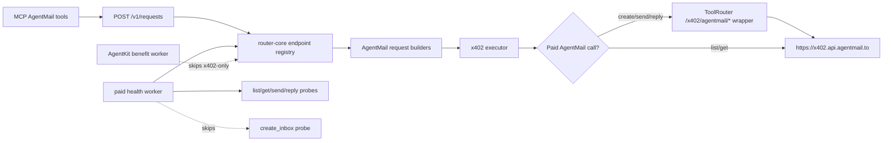

# feat: Add AgentMail x402 MVP tools

## Summary

Add a deliberately small AgentMail integration as x402-only productivity tools: create an inbox, list messages, get a message, send a message, and reply to a message. Paid AgentMail calls run through ToolRouter-owned x402 wrapper routes that add a `$0.01` surcharge before paying AgentMail upstream; zero-cost read calls remain direct or pass-through. The plan keeps AgentKit extension work out of scope, expands ToolRouter's endpoint manifest to support x402-only and GET-backed provider requests, and configures recurring health only for cheap message operations.

---

## Problem Frame

ToolRouter currently assumes every endpoint supports both AgentKit and x402, uses POST-only provider manifests, and has a recurring health probe. AgentMail's x402 integration is useful for agents because it gives them real email inboxes without API keys, but its MVP surface includes GET read operations, zero-cost calls, side-effectful paid calls, and no AgentKit benefit path yet.

---

## Requirements

- R1. Expose five AgentMail MVP tools through ToolRouter's existing `POST /v1/requests` and MCP flow: `agentmail.create_inbox`, `agentmail.list_messages`, `agentmail.get_message`, `agentmail.send_message`, and `agentmail.reply_to_message`.
- R2. Execute paid AgentMail calls through ToolRouter-owned x402 wrapper routes that charge AgentMail's current price plus a `$0.01` surcharge, then pay `https://x402.api.agentmail.to` upstream with x402. Do not send AgentMail API keys, `Authorization`, or provider-specific auth headers.
- R3. Treat AgentMail as x402-only for now: no AgentKit preflight, no AgentKit proof header, no AgentKit value label, and no AgentKit health worker checks.
- R4. Keep recurring worker spend controlled: do not recurring-probe `agentmail.create_inbox`; recurring-probe `list`, `get`, `send`, and `reply` only when configured with a dedicated AgentMail health inbox/message.
- R5. Preserve normal PR determinism: unit/integration/MCP/worker tests must not spend money; live AgentMail tests must be opt-in with strict caps.
- R6. Surface AgentMail in endpoint metadata, MCP tooling, public status/dashboard rows, and provider-logo maps without mislabeling it as an AgentKit benefit.

---

## Scope Boundaries

- No AgentKit extension or AgentKit value integration for AgentMail in this iteration.
- No AgentMail admin surfaces: domains, pods, webhooks, metrics, API keys, organization reads, allow/block lists, raw messages, attachments, drafts, forward, or reply-all.
- No surcharge on zero-cost AgentMail read endpoints. `list_messages` and `get_message` stay `$0.00`.
- No recurring `create_inbox` health probe because it costs `$2.01` after surcharge and creates persistent provider state.
- No attachment support in `send` or `reply` for the MVP MCP tools; keep message bodies text/html only.

### Deferred to Follow-Up Work

- AgentMail webhooks or WebSocket subscriptions for realtime inbound mail.
- Draft, forward, reply-all, labels/update, delete, and attachment retrieval tools.
- AgentKit access/discount/free-trial support if AgentMail later publishes an AgentKit-specific benefit path.
- A generic multi-method endpoint abstraction if more providers need broad REST coverage beyond a small set of named tools.

---

## Context & Research

### Relevant Code and Patterns

- `packages/router-core/src/endpoints/registry.ts` currently validates `endpoint.agentkit === true`, `endpoint.x402 === true`, a non-empty AgentKit value type, and `method === "POST"`. AgentMail requires loosening these invariants for x402-only, GET-backed, and zero-cost endpoints.
- `packages/router-core/src/endpoints/builders.ts` is the existing home for typed input readers, safe defaults, endpoint request construction, and estimated USD calculation.
- `packages/router-core/src/executor/agentkitExecutor.ts` already executes GET provider requests when the built provider request has no JSON body, and its allowlist is host-derived from endpoint manifest URLs.
- `packages/router-core/src/health/worker.ts` currently runs every endpoint for both availability and AgentKit benefit workers. AgentMail needs the AgentKit worker to skip x402-only endpoints and the availability worker to skip manually disabled probes.
- `apps/mcp/scripts/build-endpoints.mjs` derives published MCP tool metadata from router-core but still needs per-endpoint `input_kind` wiring.
- `apps/mcp/src/server.ts` already derives endpoint-specific MCP tools from the manifest snapshot, but new AgentMail input schemas and small result renderers are needed for useful chaining IDs.
- `tests/unit/endpoints/registry.test.mjs`, `tests/unit/endpoints/manifest.test.mjs`, `tests/unit/health/worker.test.mjs`, `tests/unit/mcp/server.test.mjs`, and `tests/integration/router/api.test.mjs` are the primary deterministic coverage points.

### Institutional Learnings

- No `docs/solutions/` directory exists in this worktree.
- `docs/plans/2026-05-20-001-feat-parallel-endpoints-plan.md` reinforces the provider-onboarding pattern: manifest, builders, MCP wiring, dashboard/status visibility, worker/live smoke coverage, and strict opt-in for spend.
- Project agent notes require provider logos for endpoint onboarding and forbid sending provider auth headers when they bypass AgentKit/x402.

### External References

- AgentMail x402 docs confirm x402-specific HTTP and WebSocket base URLs and per-request x402 payment without API keys.
- AgentMail API docs confirm the MVP operations and payloads for create inbox, list messages, get message, send message, and reply to message.
- x402scan/pay.sh metadata currently shows these AgentMail provider prices for the MVP calls: create inbox `$2.00`, list messages `$0.00`, get message `$0.00`, send message `$0.01`, and reply `$0.01`. ToolRouter wrapper prices should be `$2.01`, `$0.00`, `$0.00`, `$0.02`, and `$0.02` respectively.

---

## Key Technical Decisions

- Model AgentMail as x402-only endpoint metadata: `agentkit: false`, `x402: true`, `agentkit_value_type: null`, `agentkit_value_label: null`, and `default_payment_mode: "x402_only"`. This avoids fake AgentKit evidence and keeps dashboard copy honest.
- Add GET provider-request support to endpoint manifests while keeping ToolRouter's external call surface as `POST /v1/requests`. The API proxy remains stable; only the provider request builder emits GET for list/get.
- Allow zero-cost endpoint estimates and caps. `agentmail.list_messages` and `agentmail.get_message` should use `estimatedUsd: "0"` and worker `maxUsd: "0"` so they can still pass x402 policy while not reserving paid spend.
- Treat `agentmail.create_inbox` as manual/live-only for health. It stays a real endpoint/tool, but its recurring `health_probe` is disabled or marked manual-only so the worker does not spend `$2.01` and create inboxes on cadence.
- Configure cheap recurring AgentMail worker probes with dedicated health fixtures: `AGENTMAIL_HEALTH_INBOX_ID`, `AGENTMAIL_HEALTH_INBOX_EMAIL`, `AGENTMAIL_HEALTH_MESSAGE_ID`, and `AGENTMAIL_HEALTH_REPLY_MESSAGE_ID`. Without those env values, AgentMail message endpoints should remain unverified rather than probing arbitrary resources.
- Keep send/reply health probes low-noise by labeling or subject-prefixing health messages, using strict `maxUsd: "0.02"`, and low-frequency worker cadence inherited from the paid availability worker.
- Introduce first-party ToolRouter wrapper routes only for paid AgentMail operations. The wrapper charges provider price plus `$0.01`, then pays AgentMail's upstream x402 challenge with a ToolRouter-controlled signer. This is a nested x402 flow, unlike Manus/Parallel wrappers that call API-key upstreams.

---

## Open Questions

### Resolved During Planning

- Should AgentMail include AgentKit support now? No. Ignore AgentKit for this endpoint family until AgentMail has a confirmed AgentKit benefit path.
- Should the MVP expose the full AgentMail API? No. Start with five high-leverage tools and defer admin/realtime/attachment surfaces.
- Should recurring worker probes include create inbox? No. It is `$2.01` after surcharge and side-effectful; use deterministic and opt-in live coverage only.
- Should worker checks include send/reply/list/get? Yes. Those are cheap enough when run against a dedicated health inbox with strict caps.

### Deferred to Implementation

- Exact health fixture env names may adjust during implementation to match existing deployment naming conventions.
- Exact AgentMail provider logo asset should be taken from the best official source available during implementation.
- Exact live-test cleanup depends on whether the paid x402 identity can delete test resources without extra ownership constraints.

---

## High-Level Technical Design

> *This illustrates the intended approach and is directional guidance for review, not implementation specification. The implementing agent should treat it as context, not code to reproduce.*

AgentMail endpoints are normal ToolRouter endpoints for callers, but their metadata marks them x402-only. The availability worker uses endpoint-level probe metadata to run only configured cheap probes; the AgentKit worker filters them out before execution.

---

## Implementation Units

### U1. Support x402-only and GET-backed endpoint manifests

**Goal:** Make the endpoint registry capable of representing AgentMail honestly without breaking existing AgentKit-first endpoints.

**Requirements:** R1, R2, R3, R4, R6

**Dependencies:** None

**Files:**
- Modify: `packages/router-core/src/manifest/endpoint.ts`
- Modify: `packages/router-core/src/endpoints/registry.ts`
- Modify: `packages/router-core/src/testing/endpointHarness.ts`
- Modify: `packages/router-core/src/manifest/schema.ts`
- Test: `tests/unit/endpoints/registry.test.mjs`
- Test: `tests/unit/endpoints/manifest.test.mjs`
- Test: `tests/unit/router-core/agentkitValue.test.mjs`

**Approach:**
- Extend endpoint method support from POST-only to GET/POST for provider requests while keeping API calls through `POST /v1/requests`.
- Allow `agentkit: false` when `x402: true`; require AgentKit value metadata only when `agentkit` is true or an AgentKit benefit is declared.
- Allow `estimated_cost_usd: 0` and `estimatedUsd: "0"` for no-cost x402 resources.
- Add a health-probe mode or enabled flag that lets endpoints opt out of recurring worker checks without disabling the endpoint itself.
- Keep existing AgentKit-first endpoints strict: Exa, Browserbase, Manus, and Parallel should still declare their AgentKit value labels and health probes.

**Patterns to follow:**
- `packages/router-core/src/manifest/endpoint.ts` for manifest shape and materialized endpoint comments.
- `packages/router-core/src/testing/endpointHarness.ts` already accepts GET provider requests and zero USD strings in the lower-level request validator.
- `packages/router-core/src/agentkitValue.ts` already returns null AgentKit value when metadata is absent.

**Test scenarios:**
- Happy path: an x402-only endpoint with `agentkit: false`, `agentkit_value_type: null`, `method: "GET"`, and `estimated_cost_usd: 0` validates and appears in `listEndpoints()`.
- Regression: existing AgentKit-enabled endpoints still fail validation if they omit `agentkit_value_type` or `agentkit_value_label`.
- Error path: an endpoint with both `agentkit: false` and `x402: false` is rejected.
- Error path: an endpoint with unsupported method such as PATCH is rejected until the product intentionally supports it.
- Integration: `endpointSnapshot()` preserves null AgentKit metadata so dashboard/MCP status cannot infer a fake AgentKit benefit.

**Verification:**
- Registry and manifest snapshots include x402-only support without changing existing endpoint metadata unexpectedly.

### U2. Add AgentMail endpoint builders and manifest modules

**Goal:** Register five AgentMail MVP endpoints with typed inputs, x402-only defaults, exact prices, and safe health probe metadata.

**Requirements:** R1, R2, R3, R4, R5, R6

**Dependencies:** U1

**Files:**
- Modify: `packages/router-core/src/endpoints/builders.ts`
- Create: `packages/router-core/src/endpoints/productivity/agentmail/create-inbox.ts`
- Create: `packages/router-core/src/endpoints/productivity/agentmail/list-messages.ts`
- Create: `packages/router-core/src/endpoints/productivity/agentmail/get-message.ts`
- Create: `packages/router-core/src/endpoints/productivity/agentmail/send-message.ts`
- Create: `packages/router-core/src/endpoints/productivity/agentmail/reply-to-message.ts`
- Modify: `packages/router-core/src/endpoints/registry.ts`
- Test: `tests/unit/endpoints/registry.test.mjs`
- Test: `tests/unit/endpoints/manifest.test.mjs`

**Approach:**
- Add AgentMail constants for base URL and price defaults:
  - `create_inbox`: provider `$2.00`, ToolRouter `$2.01`
  - `list_messages`: `$0.00`
  - `get_message`: `$0.00`
  - `send_message`: provider `$0.01`, ToolRouter `$0.02`
  - `reply_to_message`: provider `$0.01`, ToolRouter `$0.02`
- Build URLs with encoded path parameters for inbox/message IDs.
- Validate AgentMail inputs conservatively:
  - `create_inbox`: optional `username`, `domain`, `display_name`, `client_id`.
  - `list_messages`: required `inbox_id`; optional `limit`, `page_token`, `labels`, time filters, and include flags.
  - `get_message`: required `inbox_id`, `message_id`.
  - `send_message`: required `inbox_id` plus at least one recipient and either `text` or `html`; optional `cc`, `bcc`, `subject`, `labels`, `reply_to`, and safe custom headers.
  - `reply_to_message`: required `inbox_id`, `message_id`, and either `text` or `html`; optional recipient overrides and `reply_all`.
- Emit only `content-type: application/json` for POST bodies and no auth headers.
- Set `default_payment_mode: "x402_only"` and no AgentKit proof header.
- Point paid endpoint manifests at ToolRouter wrapper URLs under `TOOLROUTER_X402_PROVIDER_URL || "https://toolrouter.world"`; keep zero-cost read endpoint manifests pointed at AgentMail's x402 base URL unless implementation chooses a no-surcharge pass-through wrapper for consistency.
- Mark `create_inbox` health probe as manual-only/disabled. Set message operation probes to use dedicated health fixture placeholders and strict caps.

**Patterns to follow:**
- `packages/router-core/src/endpoints/search/exa/search.ts` for direct provider-owned x402 endpoint style.
- `packages/router-core/src/endpoints/builders.ts` for typed readers and `providerRequest`.
- `packages/router-core/src/endpoints/extract/parallel/extract.ts` for URL and array validation patterns.

**Test scenarios:**
- Happy path: each builder returns the expected AgentMail URL, method, JSON/query shape, estimated USD, and `content-type` behavior.
- Happy path: `list_messages` and `get_message` emit GET requests with no JSON body and `estimatedUsd: "0"`.
- Happy path: `send_message` and `reply_to_message` accept string or array recipient fields and normalize them to the AgentMail API shape.
- Edge case: `limit` is bounded to a small safe range for message listing.
- Edge case: empty optional strings are omitted rather than sent as blank provider fields.
- Error path: missing `inbox_id`, missing `message_id`, no message body, no recipients for send, too many recipients, invalid recipient types, or non-object input throws deterministic validation errors.
- Error path: provider auth headers are never present in built requests.
- Integration: the registry lists all five AgentMail endpoints in the `productivity` category without changing the recommended endpoint until the product chooses one.
- Integration: paid AgentMail endpoint estimates include the `$0.01` surcharge and zero-cost read endpoint estimates remain `"0"`.

**Verification:**
- AgentMail endpoint requests are deterministic. Paid requests point at ToolRouter surcharge wrappers; zero-cost read requests can still point at AgentMail's provider-owned x402 endpoint.

### U7. Add AgentMail paid-operation surcharge wrappers

**Goal:** Add ToolRouter-owned x402 seller routes for the three paid AgentMail operations so ToolRouter can charge a `$0.01` surcharge while still paying AgentMail upstream through x402.

**Requirements:** R1, R2, R3, R5, R6

**Dependencies:** U1, U2

**Files:**
- Create: `apps/api/src/sellers/agentmail/index.ts`
- Create: `apps/api/src/sellers/agentmail/pricing.ts`
- Create: `apps/api/src/sellers/agentmail/upstream.ts`
- Modify: `apps/api/src/sellers/createSellerService.ts`
- Modify: `apps/api/src/app.ts`
- Modify: `packages/router-core/src/manifest/seller.ts`
- Modify: `packages/router-core/src/endpoints/productivity/agentmail/create-inbox.ts`
- Modify: `packages/router-core/src/endpoints/productivity/agentmail/send-message.ts`
- Modify: `packages/router-core/src/endpoints/productivity/agentmail/reply-to-message.ts`
- Test: `tests/unit/api/agentmail-sellers.test.mjs`
- Test: `tests/integration/router/api.test.mjs`

**Approach:**
- Add seller manifests for:
  - `/x402/agentmail/inboxes` at `$2.01`
  - `/x402/agentmail/messages/send` at `$0.02`
  - `/x402/agentmail/messages/reply` at `$0.02`
- Extend the seller-service primitive to support x402-only seller routes with no AgentKit extension/hooks. Existing Manus/Parallel free-trial behavior must remain unchanged.
- Forward each accepted wrapper call to the corresponding AgentMail x402 API route using a ToolRouter-controlled upstream payment signer, not a provider API key.
- Keep the upstream AgentMail payment receipt, payment signatures, and ToolRouter signer details server-side. The caller should see only the ToolRouter request trace and AgentMail response body.
- Reuse existing facilitator configuration patterns for ToolRouter-owned seller settlement, but add a buyer-side helper for paying upstream x402 from inside the wrapper.
- Leave list/get outside the surcharge wrapper because they are zero-cost and do not need markup.

**Patterns to follow:**
- `apps/api/src/sellers/manus/index.ts` and `apps/api/src/sellers/parallel/index.ts` for first-party seller route registration.
- `packages/router-core/src/executor/agentkitExecutor.ts` for x402 buyer payment policy, allowed chains, and max USD enforcement.
- `tests/fixtures/sellers/echo-seller/index.mjs` for seller-route fixture style.

**Test scenarios:**
- Happy path: each AgentMail seller manifest reports provider price plus `$0.01` and rejects missing pay-to config at boot like other seller services.
- Happy path: wrapper forwards the expected AgentMail upstream method/path/body after x402 settlement succeeds.
- Happy path: upstream x402 payment uses a strict cap equal to the AgentMail provider price, not the ToolRouter wrapper price.
- Happy path: x402-only seller manifests register without AgentKit hooks, while existing free-trial seller manifests still register with AgentKit storage.
- Error path: upstream AgentMail settlement failure returns a safe provider/payment error and does not leak signatures or wallet details.
- Error path: wrapper never sends AgentMail API key, `Authorization`, or provider-specific auth headers.
- Integration: `POST /v1/requests` for paid AgentMail endpoints points at ToolRouter wrapper URLs, reserves/captures the surcharge-inclusive estimate, and stores null `agentkit_value_*`.

**Verification:**
- Paid AgentMail calls produce ToolRouter revenue while still using AgentMail's x402 provider endpoint as the upstream service.

### U3. Teach execution and worker flows to respect x402-only AgentMail endpoints

**Goal:** Keep AgentMail out of AgentKit checks and run only the intended recurring paid/zero-cost availability probes.

**Requirements:** R3, R4, R5, R6

**Dependencies:** U1, U2, U7

**Files:**
- Modify: `apps/api/src/services/execution/preflight.ts`
- Modify: `packages/router-core/src/health/worker.ts`
- Modify: `apps/worker/src/health-worker.ts`
- Test: `tests/unit/api/orchestrator.test.mjs`
- Test: `tests/integration/router/api.test.mjs`
- Test: `tests/unit/health/worker.test.mjs`

**Approach:**
- Ensure AgentMail endpoints never trigger AgentKit free-trial preflight because their AgentKit value metadata is null.
- Add health-worker skip behavior for `probeKind: "agentkit"` when an endpoint is not AgentKit-enabled or has no AgentKit value metadata.
- Add health-worker skip behavior for disabled/manual-only health probes so `agentmail.create_inbox` does not run on cadence.
- Use dedicated health fixture env for message probes. If the fixture IDs are absent, return a skipped/unverified result rather than constructing invalid provider calls.
- Keep paid availability worker behavior for `send_message` and `reply_to_message` with `paymentMode: "x402_only"` and `maxUsd: "0.02"`.
- Keep zero-cost availability worker behavior for `list_messages` and `get_message` with `paymentMode: "x402_only"` and `maxUsd: "0"`.
- Track the recurring probe cost explicitly: list/get are zero-cost, send/reply are `$0.02` each after surcharge, so an hourly paid worker cadence is about `$0.96/day` or `$28.80/month` before any create-inbox smoke is intentionally enabled.

**Patterns to follow:**
- `packages/router-core/src/health/worker.ts` cadence, attribution, and layer-status logic.
- `tests/unit/health/worker.test.mjs` existing tests for AgentKit evidence reuse, x402 paid availability, and layer attribution.
- `apps/api/src/services/execution/preflight.ts` existing free-trial-only preflight guard.

**Test scenarios:**
- Happy path: paid availability probe for `agentmail.send_message` returns x402 charged success and marks facilitator/upstream/transport healthy.
- Happy path: paid availability probe for `agentmail.reply_to_message` passes `paymentMode: "x402_only"`, `maxUsd: "0.02"`, and endpoint timeout to the executor.
- Happy path: zero-cost availability probe for `agentmail.list_messages` passes `maxUsd: "0"` and records a healthy x402 path without paid amount.
- Happy path: zero-cost availability probe for `agentmail.get_message` uses the configured health message ID and records healthy status.
- Happy path: the configured recurring AgentMail probe set includes list/get/send/reply and excludes create inbox.
- Edge case: `agentmail.create_inbox` is skipped by recurring worker with a clear skip reason and no health row spend.
- Edge case: missing AgentMail health fixture env skips message probes instead of spending or producing malformed calls.
- Error path: AgentMail 402 settlement failure degrades facilitator, AgentMail 5xx attributes upstream, and timeout attributes transport using existing attribution labels.
- Integration: `runExecution` for AgentMail x402-only endpoints reserves/captures credits for paid calls, does not run preflight, and stores null `agentkit_value_*`.

**Verification:**
- Worker results prove cheap AgentMail message operations without recurring inbox creation or AgentKit false negatives.

### U4. Add AgentMail MCP tools and endpoint manifest codegen

**Goal:** Make the five AgentMail endpoints usable by agents through the published MCP server with tight schemas and useful results.

**Requirements:** R1, R2, R3, R5, R6

**Dependencies:** U1, U2, U7

**Files:**
- Modify: `apps/mcp/scripts/build-endpoints.mjs`
- Modify: `apps/mcp/src/server.ts`
- Modify: `apps/mcp/scripts/verify-dist.mjs`
- Test: `tests/unit/mcp/codegen.test.mjs`
- Test: `tests/unit/mcp/server.test.mjs`
- Test: `tests/unit/mcp/dist.test.mjs`

**Approach:**
- Add AgentMail provider logo path and MCP tool definitions:
  - `agentmail_create_inbox`
  - `agentmail_list_messages`
  - `agentmail_get_message`
  - `agentmail_send_message`
  - `agentmail_reply_to_message`
- Add input schema kinds for each AgentMail operation rather than one broad arbitrary JSON schema.
- Default max USD by tool:
  - create inbox: no automatic default for recurring worker; MCP default should be explicit or `$2.01` with the schema/copy making the spend visible.
  - list/get: `$0`.
  - send/reply: `$0.02`.
- Add result formatting that preserves ToolRouter request metadata and exposes provider IDs for chaining:
  - create inbox returns `inbox_id` and `email`.
  - send/reply returns `message_id` and `thread_id`.
  - list/get returns provider body without hiding message IDs.
- Keep generic `toolrouter_call_endpoint` working for all AgentMail endpoint IDs.

**Patterns to follow:**
- `apps/mcp/scripts/build-endpoints.mjs` existing endpoint wiring and default max USD lookup.
- `apps/mcp/src/server.ts` existing endpoint-tool derivation and specialized Manus/Parallel result rendering patterns.
- `tests/unit/mcp/server.test.mjs` existing request payload assertions.

**Test scenarios:**
- Happy path: each AgentMail MCP tool appears in `tools/list` with the expected schema and endpoint ID.
- Happy path: each MCP tool submits the correct `endpoint_id`, x402-only payment mode/default max USD, and AgentMail input shape to `POST /v1/requests`.
- Happy path: create/send/reply render `inbox_id`, `email`, `message_id`, and `thread_id` when present in the provider response.
- Error path: missing required tool inputs fail schema validation before calling ToolRouter.
- Regression: existing MCP tools and generated `dist/endpoints.json` remain in sync with the endpoint registry.

**Verification:**
- Agents can discover and call the AgentMail MVP tools without knowing raw AgentMail paths.

### U5. Surface AgentMail safely in web/status metadata

**Goal:** Add AgentMail to public and dashboard surfaces without implying an AgentKit benefit.

**Requirements:** R3, R6

**Dependencies:** U1, U2

**Files:**
- Create: `apps/web/public/agentmail-logomark.svg`
- Modify: `apps/web/lib/provider-logos.ts`
- Modify: `apps/web/lib/endpoint-manifest.ts`
- Modify: `apps/web/app/page.tsx`
- Modify: `apps/web/app/dashboard/page.tsx`
- Test: `tests/unit/web/endpoint-manifest.test.mjs`
- Test: `tests/e2e/dashboard/static.test.mjs`
- Test: `tests/integration/router/api.test.mjs`

**Approach:**
- Add a small AgentMail provider logomark from an official source where possible.
- Ensure endpoint/status DTOs allow null AgentKit value fields and render no AgentKit chip for AgentMail.
- Keep AgentMail in the `productivity` category. Do not make it a recommended generic category endpoint unless the product wants generic `toolrouter_email` later.
- Ensure dashboard rows for paid AgentMail requests display as x402 paid calls, not AgentKit.

**Patterns to follow:**
- Existing provider logo maps for `exa`, `browserbase`, `manus`, and `parallel`.
- `apps/web/app/dashboard/page.tsx` existing AgentKit-value chip rendering and null handling.
- `apps/web/app/page.tsx` public provider cards based on status API metadata.

**Test scenarios:**
- Happy path: `/v1/status` includes AgentMail endpoints with `agentkit_value_type: null`, `agentkit_value_label: null`, and safe provider metadata.
- Happy path: dashboard/static rendering does not show `AgentKit-Free Trial`, `AgentKit-Access`, or `AgentKit-Discount` on AgentMail rows.
- Regression: existing AgentKit endpoint chips continue to render.
- Regression: provider logo maps include AgentMail without breaking existing logos.

**Verification:**
- Public and authenticated UI surfaces expose AgentMail as x402-only productivity tooling.

### U6. Add deterministic and opt-in live AgentMail coverage

**Goal:** Cover the AgentMail integration end to end without normal PR spend, while providing optional live proof for x402 settlement.

**Requirements:** R4, R5

**Dependencies:** U1, U2, U3, U4, U7

**Files:**
- Create: `tests/live/endpoints/agentmail.live.test.mjs`
- Modify: `tests/live/mcp/mcp-tools.live.test.mjs`
- Test: `tests/unit/endpoints/registry.test.mjs`
- Test: `tests/integration/router/api.test.mjs`
- Test: `tests/unit/health/worker.test.mjs`
- Test: `tests/unit/mcp/server.test.mjs`

**Approach:**
- Deterministic PR coverage lives in unit/integration/MCP/worker tests with fake executors and no network spend.
- Live tests are gated by `RUN_LIVE_AGENTMAIL_TESTS=true` plus wallet/signer env.
- Live smoke should avoid recurring create-inbox cost by default. Use `AGENTMAIL_HEALTH_INBOX_ID`, `AGENTMAIL_HEALTH_INBOX_EMAIL`, `AGENTMAIL_HEALTH_MESSAGE_ID`, and `AGENTMAIL_HEALTH_REPLY_MESSAGE_ID` when present to test list/get/send/reply.
- Add a separately gated create-inbox live smoke, `RUN_LIVE_AGENTMAIL_CREATE_INBOX_SMOKE=true`, with `maxUsd: "2.01"` and clear artifact naming. This is not part of the default live suite.
- Default live message smoke sequence:
  - list messages from the configured inbox with `maxUsd: "0"`.
  - get the configured message with `maxUsd: "0"`.
  - send a health email with `maxUsd: "0.02"`.
  - reply to the configured message with `maxUsd: "0.02"`.

**Patterns to follow:**
- `tests/live/endpoints/exa.search.live.test.mjs` for opt-in gating.
- `tests/live/endpoints/browserbase.live.test.mjs` for x402 paid path smoke style.
- `tests/live/mcp/mcp-tools.live.test.mjs` for MCP live endpoint smoke conventions.

**Test scenarios:**
- Happy path: live list/get succeed with zero max USD against configured fixture IDs.
- Happy path: live send/reply succeed with strict `$0.02` caps and return message/thread IDs.
- Error path: live tests skip with explanatory reasons when required AgentMail health fixture env is missing.
- Error path: create-inbox live smoke skips unless explicitly enabled.
- Regression: normal `npm test` does not require AgentMail env and does not call the network.

**Verification:**
- AgentMail can be smoke-tested live without accidental `$2.01` inbox creation on recurring or default live paths.

---

## System-Wide Impact

- **Interaction graph:** Router-core manifests feed API execution, health worker scheduling, MCP codegen, status API, dashboard cards, and public provider metadata. AgentMail's x402-only shape must be accepted consistently across all of them.
- **Error propagation:** AgentMail provider rejections should flow through existing executor/attribution behavior. 402 settlement errors are facilitator issues; 403 message rejection and 404 missing resources are upstream/provider outcomes.
- **State lifecycle risks:** `send_message` and `reply_to_message` are side-effectful and should be run only against dedicated health fixtures in recurring worker/live tests. `create_inbox` creates persistent provider state and is not recurring-tested.
- **Payment lifecycle risks:** paid AgentMail calls are nested x402 flows. The user pays ToolRouter first; ToolRouter then pays AgentMail upstream. Upstream settlement failure must not leak ToolRouter's upstream payment material and must be reflected as provider/payment failure in the ToolRouter request trace.
- **API surface parity:** MCP tools, generic `toolrouter_call_endpoint`, `/v1/status`, dashboard request rows, and request tracing should all represent the same endpoint IDs and x402-only payment behavior.
- **Integration coverage:** Worker tests must prove the AgentKit benefit worker skips AgentMail while the availability worker handles list/get/send/reply. API tests must prove no AgentKit preflight or AgentKit value metadata is recorded.
- **Unchanged invariants:** Browser secrets remain server-side; no AgentMail API key is sent or required. Existing AgentKit-enabled endpoints keep their current labels, health checks, and preflight behavior.

---

## Risks & Dependencies

| Risk | Mitigation |
|------|------------|
| AgentMail pricing changes after implementation | Keep prices centralized in `builders.ts`, assert live responses stay within `maxUsd`, and document current pricing source in endpoint tests. |
| x402-only support weakens validation for existing endpoints | Make validation conditional: AgentKit metadata is optional only when `agentkit` is false; existing AgentKit endpoints remain strict. |
| Worker send/reply probes create inbox noise | Require dedicated health inbox/message env, use health labels/subjects, and keep strict caps. |
| Zero-dollar x402 resources still require wallet ownership | Test zero-cost list/get with configured owned health fixtures; treat 403 ownership errors as upstream/provider failures, not free public reads. |
| Nested x402 wrapper settlement can fail after ToolRouter accepts payment | Use strict upstream caps, safe error mapping, and credit release/capture tests for upstream failure. |
| `create_inbox` costs `$2.01` after surcharge and creates provider state | Disable recurring health and gate live create-inbox smoke separately. |
| GET provider requests uncover executor edge cases | Add deterministic executor/API coverage for GET request initialization before relying on live calls. |

---

## Documentation / Operational Notes

- Add AgentMail env docs for worker/live fixtures:
  - `AGENTMAIL_HEALTH_INBOX_ID`
  - `AGENTMAIL_HEALTH_MESSAGE_ID`
  - `AGENTMAIL_HEALTH_INBOX_EMAIL`
  - `AGENTMAIL_HEALTH_REPLY_MESSAGE_ID`
  - `RUN_LIVE_AGENTMAIL_TESTS`
  - `RUN_LIVE_AGENTMAIL_CREATE_INBOX_SMOKE`
- Document that `agentmail.create_inbox` is manual/live-only for health and may require `X402_MAX_USD_PER_REQUEST` above the default emergency cap when intentionally tested.
- Document expected recurring probe cost after surcharge: at hourly cadence, send plus reply is about `$0.96/day`; list and get are zero-cost; create inbox is not recurring.
- Keep user-facing copy account/tool oriented and avoid wallet-specific details in dashboard surfaces.

---

## Sources & References

- Related code: `packages/router-core/src/endpoints/registry.ts`
- Related code: `packages/router-core/src/endpoints/builders.ts`
- Related code: `packages/router-core/src/health/worker.ts`
- Related code: `apps/mcp/scripts/build-endpoints.mjs`
- Related code: `apps/mcp/src/server.ts`
- External docs: https://docs.agentmail.to/integrations/x402
- External docs: https://docs.agentmail.to/api-reference/inboxes/create
- External docs: https://docs.agentmail.to/api-reference/inboxes/messages/list
- External docs: https://docs.agentmail.to/api-reference/inboxes/messages/get
- External docs: https://docs.agentmail.to/api-reference/inboxes/messages/send
- External docs: https://docs.agentmail.to/api-reference/inboxes/messages/reply
- External pricing metadata: https://www.x402scan.com/server/8480a82b-d24f-4472-a04c-c36141f8bbb1
- External pricing metadata: https://pay.sh/services/agentmail/email
