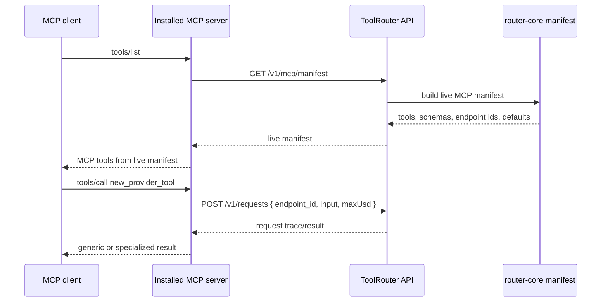

# feat: Add live MCP tool manifests

## Summary

ToolRouter should make newly deployed endpoints appear as MCP tools without requiring every agent to install a freshly published `@worldcoin/toolrouter` package. The plan moves MCP tool metadata into a live API-served manifest, updates the MCP server to prefer that manifest at runtime, and keeps the bundled manifest as a deterministic offline fallback.

---

## Problem Frame

Adding endpoints today requires coordination across endpoint registration, MCP tool wiring, package build output, npm publishing, and agent upgrades. That makes new tools fragile: if the npm package is stale, agents can see categories or endpoints in the API but cannot call the new named MCP tool through their installed server.

---

## Assumptions

*This plan was authored without synchronous user confirmation. The items below are agent inferences that fill gaps in the input -- un-validated bets that should be reviewed before implementation proceeds.*

- The immediate goal is to remove the npm-update requirement for most new endpoint tools, not to replace provider endpoint deployments or live smoke validation.
- A deployed ToolRouter API can be treated as the source of truth for endpoint and MCP tool availability, while the npm package remains a thin runtime client.
- Endpoint-specific rich response formatting can remain package-known for special async tools; newly live-deployed tools can safely fall back to the generic ToolRouter request response shape until richer handling is needed.

---

## Requirements

- R1. New endpoint MCP tool names, titles, descriptions, input schemas, and default spend-cap metadata must be deployable through the ToolRouter API without publishing a new MCP npm package.
- R2. Existing installed MCP servers must continue to work offline or against older APIs by falling back to the bundled endpoint manifest.
- R3. The API and MCP package must derive tool metadata from the same source to avoid drift between `/v1/categories`, `/v1/endpoints`, `tools/list`, and package build artifacts.
- R4. Category convenience tools must continue to route through the live recommended endpoint so category changes can deploy server-side.
- R5. Tests must prove that a remote manifest can add a tool the local bundle did not know about and that calling it uses `POST /v1/requests` with the concrete `endpoint_id`.

---

## Scope Boundaries

- This plan does not add a marketplace, user-specific endpoint entitlement filtering, or dashboard authoring flow for endpoints.
- This plan does not make already-running MCP clients hot-reload tool lists by push notification; clients that cache `tools/list` may need to refresh or restart to see a changed list.
- This plan does not attempt to infer brand-new custom result renderers from the manifest. Unknown live tools return the generic ToolRouter response.

### Deferred to Follow-Up Work

- Per-account or plan-tier tool filtering in the live manifest: a future API change can filter the manifest after authenticating the API key.
- MCP `notifications/tools/list_changed` support for clients that keep long-running sessions open and honor list-change notifications.

---

## Context & Research

### Relevant Code and Patterns

- `packages/router-core/src/endpoints/registry.ts` is the endpoint source of truth for API status, categories, request building, and health probes.
- `packages/router-core/src/manifest/schema.ts` projects endpoint metadata for downstream consumers, but it currently does not include MCP tool schemas.
- `apps/mcp/scripts/build-endpoints.mjs` hard-codes `MCP_TOOL_DEFINITIONS`, category tool definitions, provider logos, and pricing enums into `dist/endpoints.json`.
- `apps/mcp/src/server.ts` synchronously reads the bundled manifest, derives input schemas from `input_kind`, and maps named MCP tools to `POST /v1/requests`.
- `apps/api/src/routes/status.routes.ts` already owns authenticated `/v1/endpoints` and `/v1/categories`, making it the natural place for an authenticated `/v1/mcp/manifest`.
- `apps/api/src/services/monitoring.ts` currently duplicates MCP tool-name mapping for endpoint/category DTOs.

### Institutional Learnings

- `agents.md` says ToolRouter's MCP server must stay a thin wrapper over named endpoints plus generic category/list/trace tools, and must not load wallet or provider secrets.
- `agents.md` says new endpoints should update endpoint metadata, UI metadata, MCP surface, and tests together.
- Existing plan `docs/plans/2026-05-19-001-refactor-modularity-and-reliability-plan.md` introduced the bundled manifest as a prepack artifact; this plan keeps that fallback but stops treating it as the live source of truth.

### External References

- No external research was needed. This change is internal architecture around existing API, MCP, and endpoint-manifest patterns.

---

## Key Technical Decisions

- Add a router-core MCP manifest builder: The API and package build script should import one shared manifest projection instead of maintaining separate hard-coded MCP wiring maps.
- Include concrete JSON Schemas in the manifest: Old MCP servers can list new live tools even when they do not know the new `input_kind`, because `tools/list` no longer has to synthesize every schema locally.
- Prefer the live manifest in MCP runtime, fallback to bundled manifest: Runtime MCP servers should fetch `/v1/mcp/manifest` with `TOOLROUTER_API_KEY`; if the key is missing or the request fails, they should keep using `dist/endpoints.json`.
- Keep calls generic for unknown live tools: Named tool invocation only needs the tool name, endpoint id, input object, and default `maxUsd`; specialized result shaping remains an enhancement, not a prerequisite for live tool availability.
- Keep category recommendation lookup live: Category wrappers should still ask `/v1/categories?include_empty=true` for the current recommended endpoint before calling `/v1/requests`.

---

## Open Questions

### Resolved During Planning

- Should the live manifest be public? No. It should require the same API-key auth as `/v1/endpoints` so future per-key filtering can be added without another contract break.
- Should unknown live tools be blocked until the package understands their result shape? No. Generic result shaping is enough to make most tools usable immediately.

### Deferred to Implementation

- Exact cache TTL for the remote manifest: choose a small, conservative runtime TTL during implementation and keep fallback deterministic.
- Exact manifest schema version number: update after the final manifest fields are known.

---

## High-Level Technical Design

> *This illustrates the intended approach and is directional guidance for review, not implementation specification. The implementing agent should treat it as context, not code to reproduce.*

---

## Implementation Units

### U1. Shared MCP Manifest Projection

**Goal:** Move MCP tool wiring, category tool wiring, provider-logo paths, pricing metadata, and input-schema generation into router-core so the API and MCP build script share one projection.

**Requirements:** R1, R3

**Dependencies:** None

**Files:**
- Create: `packages/router-core/src/mcp/manifest.ts`
- Modify: `packages/router-core/src/index.ts`
- Modify: `apps/mcp/scripts/build-endpoints.mjs`
- Test: `tests/unit/mcp/codegen.test.mjs`
- Test: `tests/unit/endpoints/manifest.test.mjs`

**Approach:**
- Introduce a `buildMcpManifest()` helper that projects `endpointRegistry` into the existing manifest shape plus concrete `input_schema` fields.
- Move the existing endpoint and category tool definitions from `apps/mcp/scripts/build-endpoints.mjs` into router-core.
- Keep build output deterministic by stripping timestamps or omitting them for generated artifacts, matching the current snapshot behavior.
- Export helper lookups for endpoint/category MCP tool names so monitoring DTOs can stop duplicating the mapping.

**Patterns to follow:**
- `packages/router-core/src/manifest/schema.ts` for deterministic endpoint projections.
- `apps/mcp/scripts/build-endpoints.mjs` for the current MCP definitions and pricing enum shape.

**Test scenarios:**
- Happy path: building the manifest returns one endpoint tool entry for every registered endpoint and includes `input_schema` for each endpoint and category tool.
- Edge case: an endpoint missing MCP wiring still fails manifest generation so new endpoint onboarding cannot silently omit the MCP surface.
- Integration: the package codegen artifact still equals the shared router-core projection.

**Verification:**
- The package build script becomes a thin writer around the shared builder.
- Manifest tests prove registry-to-MCP drift is caught in one place.

### U2. Authenticated Live Manifest API

**Goal:** Add a live API endpoint that serves the MCP manifest to installed MCP servers.

**Requirements:** R1, R3

**Dependencies:** U1

**Files:**
- Modify: `apps/api/src/routes/status.routes.ts`
- Test: `tests/integration/router/api.test.mjs`

**Approach:**
- Add `GET /v1/mcp/manifest` behind `authenticateApiKey`.
- Return the shared router-core MCP manifest with the concrete schemas included.
- Keep the response badge-safe: endpoint ids, tool names, descriptions, schemas, price defaults, categories, and provider metadata are allowed; no wallet, API key, provider secret, or payment signature data should appear.

**Patterns to follow:**
- Existing `/v1/endpoints` and `/v1/categories` authenticated routes in `apps/api/src/routes/status.routes.ts`.
- Existing API integration auth tests in `tests/integration/router/api.test.mjs`.

**Test scenarios:**
- Happy path: authenticated request returns schema version, endpoint tools, category tools, and a known tool such as `exa_search`.
- Error path: unauthenticated request returns 401.
- Integration: a returned endpoint tool includes an `input_schema` that can be used directly by MCP `tools/list`.

**Verification:**
- The live manifest is reachable with an API key and unavailable without one.

### U3. MCP Runtime Remote-Manifest Loader

**Goal:** Make the installed MCP server prefer the API-served manifest for `tools/list` and tool invocation while preserving bundled fallback behavior.

**Requirements:** R1, R2, R4, R5

**Dependencies:** U2

**Files:**
- Modify: `apps/mcp/src/server.ts`
- Test: `tests/unit/mcp/server.test.mjs`

**Approach:**
- Add an async remote manifest loader that uses the same normalized API base and API key logic as existing ToolRouter API calls.
- Cache the successful remote manifest briefly per API base/key combination so repeated `tools/list` calls do not add avoidable latency.
- Fall back to `loadEndpointsManifest()` whenever `TOOLROUTER_API_KEY` is missing, `TOOLROUTER_MCP_LIVE_MANIFEST=false`, the remote endpoint fails, or the response is malformed.
- Change JSON-RPC `tools/list` and named tool calls to resolve tool specs from the best available manifest for the request environment.
- Use manifest-provided `input_schema` first; only synthesize schemas from `input_kind` for old bundled manifests that lack concrete schemas.
- For remote tool names unknown to the package, send top-level arguments as the endpoint input and return the generic ToolRouter result.

**Patterns to follow:**
- Existing `routerFetch`, `apiConfig`, `endpointToolSpecs`, and `endpointPayload` helpers in `apps/mcp/src/server.ts`.
- Existing compatibility behavior for `maxUsd`, `max_usd`, `payment_mode`, and category recommended endpoint lookup.

**Test scenarios:**
- Happy path: `tools/list` with a remote manifest includes a synthetic remote-only tool not present in the bundled manifest.
- Happy path: calling that remote-only tool posts to `/v1/requests` with the remote endpoint id, top-level input fields, and manifest default `maxUsd`.
- Error path: remote manifest fetch failure still lists bundled tools such as `exa_search`.
- Edge case: a manifest-provided schema is used even when `input_kind` is unknown locally.
- Integration: category wrapper calls still fetch `/v1/categories?include_empty=true` and use the live recommended endpoint.

**Verification:**
- Installed MCP servers can expose and call a newly deployed tool from API manifest data alone.

### U4. DTO Mapping and Documentation Cleanup

**Goal:** Remove duplicated MCP tool-name mapping where practical and document the new live-deploy behavior for endpoint onboarding and MCP users.

**Requirements:** R3, R4

**Dependencies:** U1, U2, U3

**Files:**
- Modify: `apps/api/src/services/monitoring.ts`
- Modify: `apps/mcp/README.md`
- Modify: `docs/plans/2026-05-21-001-feat-live-mcp-tool-manifest-plan.md` if implementation reveals important constraints
- Test: `tests/integration/router/api.test.mjs`
- Test: `tests/unit/mcp/server.test.mjs`

**Approach:**
- Derive endpoint MCP tool names from router-core manifest helpers instead of open-coded conditionals when it improves clarity.
- Keep special async helper maps for Manus and Parallel where the runtime exposes multiple follow-up tools.
- Update MCP README to explain that the package fetches a live manifest from `TOOLROUTER_API_URL`, falls back to the bundled manifest, and can be forced offline with `TOOLROUTER_MCP_LIVE_MANIFEST=false`.

**Patterns to follow:**
- Existing `recommended_mcp_tool` and `mcp_tools` response fields from `apps/api/src/services/monitoring.ts`.
- Existing MCP README environment-variable style.

**Test scenarios:**
- Happy path: `/v1/endpoints` and `/v1/categories` still expose the expected recommended MCP tool names.
- Edge case: special async endpoints still expose start/status/result helper names.
- Documentation expectation: no automated doc test required unless existing README checks already cover package docs.

**Verification:**
- API DTOs, MCP tools, and package docs describe the same live-manifest source of truth.

---

## System-Wide Impact

- **Interaction graph:** `tools/list` gains an API dependency when configured with an API key, but fallback keeps local startup usable.
- **Error propagation:** Live manifest failures should be swallowed into bundled fallback for listing; actual tool-call failures should continue to return MCP `isError` payloads as today.
- **State lifecycle risks:** Remote manifest caching can make a new deploy visible after a short delay; TTL must stay short enough for "live deploy" expectations.
- **API surface parity:** `/v1/endpoints`, `/v1/categories`, MCP `tools/list`, and package codegen all depend on the same router-core projection after this change.
- **Integration coverage:** Unit tests need remote-only manifest fixtures because the checked-in registry cannot prove that an unknown future tool works.
- **Unchanged invariants:** MCP still never reads wallet private keys, provider API keys, Supabase service-role keys, or payment signatures.

---

## Risks & Dependencies

| Risk | Mitigation |
|------|------------|
| Live `tools/list` becomes slower or flaky when the API is unavailable | Use a small remote fetch path with bundled fallback and short cache TTL |
| Old package cannot synthesize schemas for new input kinds | Include concrete `input_schema` in the API manifest and prefer it at runtime |
| New endpoints need special result shaping | Return generic ToolRouter traces by default; add package-side rich formatters later only when the generic result is inadequate |
| Tool-name mapping drifts between API and MCP package | Move mapping into router-core and make codegen/API tests consume the same builder |

---

## Documentation / Operational Notes

- Endpoint deploy checklist should treat `/v1/mcp/manifest` as the live verification target before announcing a tool.
- A new npm release is still useful for protocol/runtime improvements, but ordinary endpoint additions should only require deploying the ToolRouter API and web surfaces.
- Operators can set `TOOLROUTER_MCP_LIVE_MANIFEST=false` for deterministic local debugging against the bundled manifest.

---

## Sources & References

- Related code: `apps/mcp/src/server.ts`
- Related code: `apps/mcp/scripts/build-endpoints.mjs`
- Related code: `packages/router-core/src/endpoints/registry.ts`
- Related code: `packages/router-core/src/manifest/schema.ts`
- Related code: `apps/api/src/routes/status.routes.ts`
- Related code: `apps/api/src/services/monitoring.ts`
- Project guidance: `agents.md`
